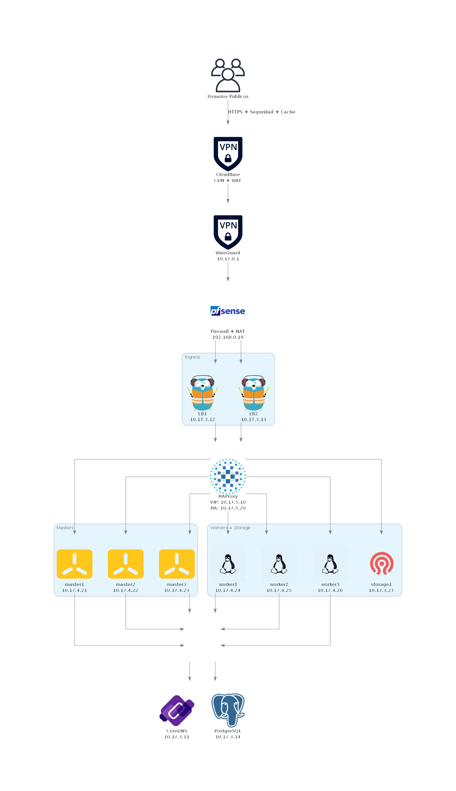
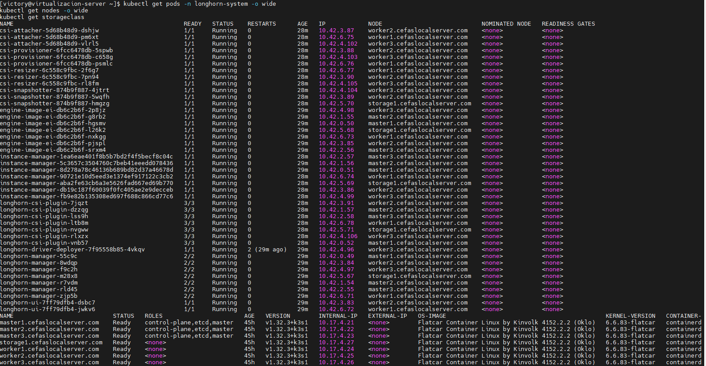
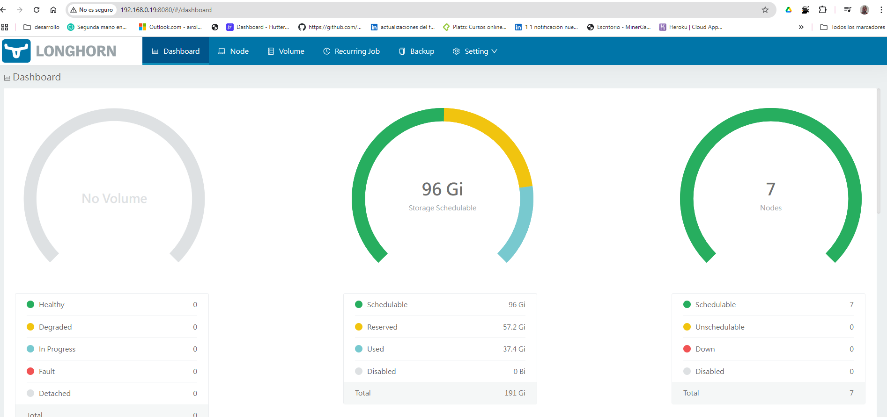

# FlatcarMicroCloud: Entorno Kubernetes Optimizado para Servidores Físicos

## Descripción General del Proyecto

**FlatcarMicroCloud** es una solución Kubernetes diseñada para maximizar los recursos de un servidor físico. El entorno se ejecuta sobre un servidor **ProLiant DL380 G7**, utilizando **Rocky Linux 9.5** como sistema operativo base para virtualización, junto con **AlmaLinux 9.4** en algunos nodos auxiliares. Las máquinas virtuales que componen el clúster Kubernetes utilizan **Flatcar Container Linux** como sistema operativo liviano y seguro.

Esta arquitectura permite desplegar aplicaciones en contenedores mediante herramientas modernas como:

- **K3s**, una distribución ligera de Kubernetes.
- **Longhorn y NFS** para almacenamiento persistente.
- **Prometheus y Grafana** para monitoreo y visualización avanzada.
- **Redpanda y MQTT Mosquitto** para comunicación asincrónica entre microservicios.

## Hardware del Servidor


- **Modelo**: ProLiant DL380 G7
- **CPU**: Intel Xeon X5650 (24 cores) @ 2.666GHz
- **GPU**: AMD ATI ES1000
- **Memoria Total**: 35 GB RAM
- **Almacenamiento**:
  - Disco Principal: 1.5TB
  - Disco Secundario: 3.0TB

## Sistemas Operativos y Virtualización

- **Sistemas Operativos**: Rocky Linux 9.5 y Flatcar Container Linux y Alma Linux 9.4
- **Virtualización**: KVM con Libvirt y Virt-Manager y oVirt
- **Configuración de Red**: VPN con WireGuard, DHCP, firewall, y configuraciones de redes virtuales (NAT y Bridge) con KVM.
- **Switch y Router**: Facilitan la comunicación y conectividad del clúster.

## Resumen de Recursos para Máquinas Virtuales

| **Hostname**    | **IP**        | **Dominio**                  | **CPU** | **Memoria (MB)** | **Disco (GB)** |
|-----------------|---------------|-----------------------------|---------|------------------|----------------|
| master1         | 10.17.4.21    | master1.cefaslocalserver.com | 2       | 4096             | 50             |
| master2         | 10.17.4.22    | master2.cefaslocalserver.com | 2       | 4096             | 50             |
| master3         | 10.17.4.23    | master3.cefaslocalserver.com | 2       | 4096             | 50             |
| worker1         | 10.17.4.24    | worker1.cefaslocalserver.com | 2       | 4096             | 50             |
| worker2         | 10.17.4.25    | worker2.cefaslocalserver.com | 2       | 4096             | 50             |
| worker3         | 10.17.4.26    | worker3.cefaslocalserver.com | 2       | 4096             | 50             |
| storage1        | 10.17.3.27    | storage1.cefaslocalserver.com| 2       | 2048             | 80             |
| infra-cluster   | 10.17.3.11    | infra-cluster.cefaslocalserver.com| 2   | 2048             | 32             |
| loadbalancer1   | 10.17.3.12    | loadbalancer1.cefaslocalserver.com | 2   | 2048             | 32             |
| loadbalancer2   | 10.17.3.13    | loadbalancer2.cefaslocalserver.com | 2   | 2048             | 32             |
| postgresql1     | 10.17.3.14    | postgresql1.cefaslocalserver.com | 2     | 2048             | 32             |
| k8s-api-lb      | 10.17.5.10    | k8s-api-lb.cefaslocalserver.com | 2     | 2048             | 80             |

## Máquinas Virtuales y Roles

| Nodo               | Sistema Operativo       | Función                                    | Cantidad |
| ------------------ | ----------------------- | ------------------------------------------ | -------- |
| k8s-api-lb         | Alma Linux              | gestion y seguridad                        | 1        |
| Load Balancer Node | Alma Linux              | Balanceo Traefik controlador de ingress    | 2        |
| infra-cluster Node | Alma Linux              | DNS coredns / ntp  Chrony                  | 1        |
| PostgreSQL Node    | Alma Linux              | Base de datos central para microservicios  | 1        |
| Master Node        | Flatcar Container Linux | Administración de API de Kubernetes        | 3        |
| Worker Nodes       | Flatcar Container Linux | Ejecución de microservicios y aplicaciones | 3        |
| storage1           | Alma Linux              | almacenacenamiento                         | 1        |

## Explicación de Roles de las VMs

- **Maestros (master1, master2, master3)**:
  - Nodos que conforman el plano de control de Kubernetes, manejando la API y distribuyendo la carga en los nodos worker.

- **Workers (worker1, worker2, worker3)**:
  - Nodos que ejecutan aplicaciones y microservicios, proporcionando la capacidad de escalar horizontalmente.

- **infra-cluster (infra-cluster)**:
  - Nodo que actúa como servidor DNS coredns y ntp  Chrony

- **Load Balancer (load_balancer1,load_balancer2)**:
  - Nodos que distribuyen el tráfico de red entre los nodos maestros y workers, asegurando un balanceo de carga eficiente.

- **PostgreSQL (postgresql1)**:
  - Nodo dedicado para la base de datos, proporcionando almacenamiento persistente para las aplicaciones de microservicios.

## Fases de Implementación

### Fase 1: Instalación y Configuración de K3s en el Clúster de Kubernetes

1. **Nodo Master1**: Instalación de K3s y configuración inicial del clúster.
2. **Nodos Master y Worker**: Configuración de nodos maestros y workers, desplegando Traefik como balanceador.

### Fase 2: Configuración de PostgreSQL

| Aspecto                 | Configuración                                                            |
| ----------------------- | ------------------------------------------------------------------------ |
| Servidor                | `postgresql1.cefaslocalserver.com`                                       |
| Permisos                | Ajusta permisos para permitir el acceso de microservicios en el clúster. |
| Respaldo y Recuperación | Define políticas para almacenamiento y recuperación de datos.            |

### Fase 3: Desarrollo e Implementación de Microservicios

- **Apache Kafka**: Canal de comunicación asíncrona entre microservicios.
- **MQTT Mosquitto**: Protocolo ligero para notificaciones en tiempo real.
- **Redis**: Base de datos en memoria para almacenamiento en caché y escalabilidad.

### Fase 4: Desarrollo del Frontend con Vue.js

- **Vue.js** para la interfaz de usuario, conectada a APIs de FastAPI. Desplegado en el clúster con acceso a través del balanceador Traefik.

## Automatización y Orquestación

- **Terraform**: Automatización de infraestructura.
- **Ansible**: Configuración y manejo de operaciones.

## Pasos para la Implementación

### Paso 1: Preparativos Iniciales

Clonar el repositorio en el servidor Rocky Linux.

#### Estructura del Proyecto

- `nat_network_01/`
- `nat_network_02/`
- `nat_network_03/`

#### Requisitos

- [Terraform](https://www.terraform.io/downloads.html) v0.13 o superior
- Acceso a un servidor KVM con libvirt

## Red y Conectividad

```bash
# Clonar repositorio
git clone https://github.com/vhgalvez/FlatcarMicroCloud.git
cd FlatcarMicroCloud
```

### Paso 2: Configuración de Redes Virtuales con Terraform

- **Red nat_network_02**:

  ```bash
  # Navegar a nat_network_01
  cd nat_network_01
  # Inicializar y aplicar Terraform
  sudo terraform init --upgrade
  sudo terraform apply
  ```

- **Red nat_network_02**:

  ```bash
  # Navegar a nat_network_02
  cd ../nat_network_02
  # Inicializar y aplicar Terraform
  sudo terraform init --upgrade
  sudo terraform apply
  ```

- **Red nat_network_03**:

  ```bash
  # Navegar a nat_network_03
  cd ../nat_network_03
  # Inicializar y aplicar Terraform
  sudo terraform init --upgrade
  sudo terraform apply
  ```

---

### Componentes

- **Prometheus**: Servidor de métricas.
- **Grafana**: Visualización de dashboards.
- **Node Exporter**: Métricas del sistema operativo.
- **PushGateway**: Recepción de métricas push.
- **Scrape Externo**: Monitorización de máquinas fuera del clúster.

---

## ✅ **Infraestructura Lista**

Al finalizar todos los pasos, tu entorno Kubernetes con alta disponibilidad estará completamente configurado y operativo, con los siguientes componentes:

- **DNS**
- **Balanceo de carga** con HAProxy + Keepalived (VIP)
- **Clúster Kubernetes** con K3s en alta disponibilidad (etcd)
- **Ingress Controller** con certificados TLS usando Traefik
- **Almacenamiento persistente** con NFS y Longhorn listo para usarse

---

### ✨ **Desarrollado para la solución FlatcarMicroCloud**

Este flujo de trabajo está optimizado para ser desplegado sobre **servidores físicos o virtualizados**, garantizando una solución robusta y escalable.
---

## Maquinas Virtuales Monitoreo y Gestión de Recursos


---

## Notas Adicionales

- Asegúrese de tener las variables y configuraciones adecuadas en los archivos `terraform.tfvars` de cada subproyecto.
- Cada subproyecto tiene su propio `main.tf` y configuración de variables, por lo que no debería haber conflictos de nombres si sigue las instrucciones anteriores.
- Puede ajustar las configuraciones y variables según sea necesario para adaptarse a su entorno y necesidades específicas.

### Paso 3: Instalación de VMs y Sistemas Operativos

Provisionar y configurar VMs según especificaciones en la tabla de recursos, asegurando la asignación de CPU, RAM, y almacenamiento.

### Paso 5: Configuración de Almacenamiento Persistente

Instalar y configurar Longhorn y NFS en el clúster de Kubernetes para almacenamiento persistente.

### Paso 6: Configuración de Monitoreo y Visualización

- Configurar **Prometheus** y **Grafana** para monitoreo.
- Configurar **ELK Stack** para análisis de logs y visualización de datos.

### Paso 7: Configuración de CI/CD y Automatización

Configurar Jenkins y/o GitHub Actions para la integración continua (CI), ejecutando pruebas automáticas, análisis de código y construcción de imágenes de contenedor.

Configurar un Docker Registry (privado o público) para almacenar y versionar imágenes generadas por el proceso de CI.

Configurar ArgoCD como herramienta de despliegue continuo (CD), conectando los cambios en el repositorio con el entorno de Kubernetes mediante una estrategia GitOps.

### Paso 8: Configuración de Seguridad

Configurar reglas de **firewall**, **Fail2Ban** y políticas de seguridad.

### Paso 9: Sincronización y NTP

Configurar **chronyc** en todos los nodos para sincronización temporal.

### Paso 10: Pruebas Finales y Puesta en Producción

- Verificar configuración de red y DNS.
- Probar despliegue de aplicaciones y monitorización de métricas.
- Asegurar que el balanceador de carga y servicios en Kubernetes estén operativos.

Este flujo garantiza que todas las dependencias y configuraciones sean instaladas en el orden correcto y optimizadas para un entorno de producción.

## Microservicios en Pods

### Servicios de Aplicaciones

- **Nginx**: Servidor web para aplicaciones.
- **Redis**: Almacenamiento en caché y base de datos en memoria para mejorar el rendimiento de las aplicaciones.
- **Kafka**: Plataforma de mensajería utilizada para la comunicación entre microservicios.

### Análisis y Visualización de Datos

- **Prometheus**: Herramientas para el monitoreo y alertas.
- **Grafana**: Visualización de métricas del clúster.
- **Nagios**: Monitoreo del rendimiento del sistema.
- **cAdvisor**: Monitoreo del rendimiento y uso de recursos por parte de los contenedores.
- **ELK Stack**: Procesamiento y visualización de logs.

## Seguridad y Protección

- **Firewall nftables**: Configuración de reglas de firewall para proteger el clúster.
- **Fail2Ban**: Protección contra accesos no autorizados y ataques.

## Almacenamiento Persistente

- **Longhorn**: Orquestar Longhorn en Kubernetes para almacenamiento persistente.
- **NFS**: Configurar NFS para almacenamiento compartido entre nodos para base de datos postgresql.

## Redes Virtuales y Arquitectura de Red

### Redes Virtuales Configuradas

| Red NAT         | Nodos         | Dirección IP | Rol del Nodo                             |
| --------------- | ------------- | ------------ | ---------------------------------------- |
| kube_network_02 | infra-cluster | 10.17.3.11   | Servidor de DNS y gestión de identidades |
| kube_network_02 | loadbalancer1 | 10.17.3.12   | Balanceo de carga para el clúster        |
| kube_network_02 | loadbalancer2 | 10.17.3.13   | Balanceo de carga para el clúster        |
| kube_network_02 | postgresql1   | 10.17.3.14   | Gestión de bases de datos                |
| kube_network_03 | master1       | 10.17.4.21   | Gestión del clúster                      |
| kube_network_03 | master2       | 10.17.4.22   | Gestión del clúster                      |
| kube_network_03 | master3       | 10.17.4.23   | Gestión del clúster                      |
| kube_network_03 | worker1       | 10.17.4.24   | Ejecución de aplicaciones                |
| kube_network_03 | worker2       | 10.17.4.25   | Ejecución de aplicaciones                |
| kube_network_03 | worker3       | 10.17.4.26   | Ejecución de aplicaciones                |
| kube_network_03 | storage1      | 10.17.4.27   | Almacenamiento                          |

### Red nat_network_01

| Red NAT | Nodo       | Dirección IP | Rol del Nodo                             |
| ------- | ---------- | ------------ |------------------------------------------|
| kube_network_01     | k8s-api-lb | 10.17.5.10   | HAProxy + Keepalived VIP                 |

## Detalles de Configuración

- **Imágenes Base**:

  - Fedora CoreOS: `/mnt/lv_data/organized_storage/images/fedora-coreos-40.20240906.3.0-qemu.x86_64.qcow2`
  - Rocky Linux: `/mnt/lv_data/organized_storage/images/Rocky-9-GenericCloud-Base.latest.x86_64.qcow2`
  - Alma Linux: `/mnt/lv_data/organized_storage/images/AlmaLinux-9.4-x86_64.qcow2`
  - pfsense: `/mnt/lv_data/organized_storage/images/pfsense_base.qcow2`
  - Flatcar Container Linux: `/mnt/lv_data/organized_storage/images/flatcar_production_qemu_image.img`

- **Red Gateway**:
  
  - kube_network_01: 10.17.5.1  
  - kube_network_02: 10.17.3.1
  - kube_network_03: 10.17.4.1

- **DNS**:

  - Primario: 10.17.3.11 (infra-cluster)
  - Secundario: 8.8.8.8

- **Zona Horaria**:

  - Europe/London

- **Clave SSH**:

  - Clave pública SSH incluida para acceso seguro a las VMs.

## Configuración de Redes Virtuales

### Red nat_network_01

```hcl
resource "libvirt_network" "Kube_network_01" {
  name      = var.rocky9_network_name
  mode      = "nat"
  autostart = true
  addresses = ["10.17.5.0/24"]
}
```

### Red kube_network_02 - NAT Network

```hcl
resource "libvirt_network" "kube_network_02" {
  name      = "kube_network_02"
  mode      = "nat"
  autostart = true
  addresses = ["10.17.3.0/24"]
}
```

### Red kube_network_03 - NAT Network

```hcl
resource "libvirt_network" "kube_network_03" {
  name      = "kube_network_03"
  mode      = "nat"
  autostart = true
  addresses = ["10.17.4.0/24"]
}
```

## Configuración de Redes Virtuales

- **Switch**: TP-Link LS1008G - 8 puertos Gigabit no administrados
- **Router WiFi**: Conexión fibra óptica, 600 Mbps de subida/bajada, IP pública
- **Red**: Configurada red NAT y red Bridge de kvm
- **VPN**: WireGuard para acceso seguro SSH administrado por Bastion Node

## Chronyc / NTP

- **Sincronización de tiempo**:
  Todos los nodos del clúster, incluyendo los nodos maestros, workers y el Bootstrap Node, sincronizan su tiempo utilizando **chronyc**. Esto garantiza que todos los nodos mantengan una sincronización temporal precisa, lo cual es crucial para la operación correcta de Kubernetes y otros servicios distribuidos.

## Recursos de Automatización

| Proyecto                     | Repositorio                                                                                                                              |
| ---------------------------- | ---------------------------------------------------------------------------------------------------------------------------------------- |
| CoreDNS                      | [https://github.com/vhgalvez/ansible-CoreDNS-setup-Linux](https://github.com/vhgalvez/ansible-CoreDNS-setup-Linux)                       |
| NTP / Chrony                 | [https://github.com/vhgalvez/ansible-ntp-chrony-kubernetes](https://github.com/vhgalvez/ansible-ntp-chrony-kubernetes)                   |
| HAProxy + Keepalived         | [https://github.com/vhgalvez/ansible-haproxy-keepalived](https://github.com/vhgalvez/ansible-haproxy-keepalived)                         |
| K3s HA (etcd)                | [https://github.com/vhgalvez/ansible-k3s-etcd-cluster](https://github.com/vhgalvez/ansible-k3s-etcd-cluster)                             |
| Traefik Ingress Controller   | [https://github.com/vhgalvez/traefik-k8s-ingress-controller-ansible](https://github.com/vhgalvez/traefik-k8s-ingress-controller-ansible) |
| Storage NFS + Longhorn       | [https://github.com/vhgalvez/flatcar-k3s-storage-suite](https://github.com/vhgalvez/flatcar-k3s-storage-suite)                           |
| Stack de Monitoreo           | [https://github.com/vhgalvez/ansible-monitoring-stack](https://github.com/vhgalvez/ansible-monitoring-stack)                             |
| Generar Clave SSH Compartida | [https://github.com/vhgalvez/generate_shared_ssh_key](https://github.com/vhgalvez/generate_shared_ssh_key)                               |
| Jenkins CI/CD                | [https://github.com/vhgalvez/jenkins-ansible-playbook](https://github.com/vhgalvez/jenkins-ansible-playbook)                             |
| ArgoCD                       | [https://github.com/vhgalvez/ArgoCD-ansible-kubernetes](https://github.com/vhgalvez/ArgoCD-ansible-kubernetes)                           |


## Arquitectura de Infraestructura Global de FlatcarMicroCloud





**Repositorio:** [arquitectura_FlatcarMicroCloud](https://github.com/vhgalvez/arquitectura_FlatcarMicroCloud) - https://github.com/vhgalvez/arquitectura_FlatcarMicroCloud

Este diagrama fue generado con **Python** utilizando la librería [Diagrams by Mingrammer](https://github.com/mingrammer/diagrams).  
Representa la arquitectura completa del proyecto [FlatcarMicroCloud](https://github.com/vhgalvez/FlatcarMicroCloud), incluyendo red pública, túnel VPN, balanceadores Ingress, clúster Kubernetes con K3s, almacenamiento distribuido y servicios esenciales.

## Arquitectura de Kubernetes (Cluster K3s)


## Homelab Server (Servidor Físico ProLiant DL380 G7)


## Arquitectura de Red (Router fibra optica y Switch TP-Link LS1008G)


## Interfaz Web de Administración (Cockpit en Rocky Linux)


Pantalla de inicio de sesión de **Cockpit**, una interfaz web para administrar servidores **Rocky Linux** de forma remota y gráfica. Permite monitorear el sistema, gestionar servicios, redes, usuarios y acceder a una terminal sin depender exclusivamente de la línea de comandos.

## Longhorn instalado en el clúster K3s 





## Optimización para Producción

| Aspecto                     | Detalle                                                                                            |
| --------------------------- | -------------------------------------------------------------------------------------------------- |
| Restricción de Recursos     | Configura límites en Kubernetes para cada servicio (Prometheus, PostgreSQL, Redpanda, Redis).         |
| Control de Logs y Monitoreo | Define políticas de retención de logs en Prometheus y Kafka para reducir el consumo de disco.      |
| Supervisión Activa          | Usa Grafana para monitoreo en tiempo real, ajustando recursos según los picos de carga detectados. |

Estas optimizaciones aseguran un entorno escalable y eficiente para producción.

## Interfaz de Red

| Interfaz     |
| ------------ |
| **enp3s0f0** |
| **enp3s0f1** |
| **enp4s0f0** |
| **enp4s0f1** |
| **lo**       |

Estas interfaces están conectadas a un switch y un router de fibra óptica, operando bajo DHCP y facilitando la conectividad y administración del clúster.

## Resumen del Flujo

1. **Ingreso de Conexiones Externas**:  
   Las conexiones HTTPS externas ingresan a través de la IP pública del servidor físico, pasando por un proxy seguro configurado en **Cloudflare CDN** para protección contra ataques DDoS y caché de contenido.

2. **Acceso Seguro**:  
   El tráfico es redirigido al **WireGuard VPN Gateway** (IP túnel: 10.17.0.1) y luego al **Bastion Node** (192.168.0.19), que actúa como punto de acceso seguro a la red interna.

3. **Distribución de Tráfico**:  
   Los balanceadores de carga **Load Balancer1** y **Load Balancer2** (Traefik) distribuyen el tráfico hacia los nodos maestros y workers, asegurando alta disponibilidad y balanceo eficiente.

4. **Resolución de Nombres y Sincronización de Tiempo**:  
   El nodo **infra-cluster** (10.17.3.11) actúa como servidor **DNS** (CoreDNS) y **NTP** (Chrony), proporcionando resolución de nombres y sincronización temporal precisa en todo el clúster.

5. **Ejecución de Aplicaciones**:  
   Los **nodos workers** ejecutan las aplicaciones y microservicios, mientras que los **nodos maestros** gestionan el plano de control de Kubernetes. Todos los nodos mantienen sincronización temporal mediante **chronyc**.

---

1. **Ingreso de Conexiones Externas**:

   - Las conexiones HTTPS externas ingresan por la IP pública (192.168.0.21).

2. **Acceso Seguro**:

   - El tráfico pasa por el Bastion Node (192.168.0.20) para acceder de manera segura a la red interna.

3. **Distribución de Tráfico**:

   - Los Load Balancers (Traefik) distribuyen el tráfico hacia los nodos maestros y workers, asegurando un balanceo eficiente.

4. **Resolución de Nombres y Sincronización de Tiempo**:

   - El nodo `infra-cluster` actúa como servidor DNS y NTP, garantizando la resolución de nombres y la sincronización temporal en todo el clúster.

5. **Ejecución de Aplicaciones**:

   - Los nodos workers y maestros ejecutan las aplicaciones, manteniendo la sincronización temporal a través de `chronyc`.

## 🌐 Configuración de Redes Virtuales con pfSense


Esta sección te guía en la configuración de redes virtuales utilizando **pfSense como firewall** dentro de tu infraestructura KVM. Aprovecha el proyecto automatizado con Terraform para desplegar pfSense rápidamente como una máquina virtual lista para enrutar tráfico entre redes virtualizadas.

---

### 🔗 Repositorio Oficial

Accede al código fuente y plantillas de Terraform en el siguiente repositorio:

[📦 GitHub – terraform-pfsense-kvm-libvirt](https://github.com/vhgalvez/terraform-pfsense-kvm-libvirt)

---

### 🚀 Clona el repositorio

Para comenzar con la configuración:

```bash
git clone https://github.com/vhgalvez/terraform-pfsense-kvm-libvirt.git
cd terraform-pfsense-kvm-libvirt
```

---

## 🔧 Recursos Adicionales Soportados por HP – Firmware ProLiant DL380 G7

Consulta y descarga actualizaciones oficiales de firmware y software para tu servidor HP desde el portal de soporte de Hewlett Packard Enterprise:

- [🔗 Firmware HP ProLiant DL380 G7 – Página oficial de soporte](https://support.hpe.com/connect/s/softwaredetails?collectionId=MTX-5db24d8d46d14448&language=en_US&tab=releaseNotes)

## 💿 Imágenes de Disco para VMs

## ✅ Flatcar para KVM/Libvirt: Descarga y preparación

### 🔽 1. Descargar imagen comprimida

```bash
sudo curl -O https://stable.release.flatcar-linux.net/amd64-usr/current/flatcar_production_qemu_image.img.bz2
```

### 🔐 2. (Opcional) Verificar firma

```bash
sudo curl -O https://www.flatcar.org/security/image-signing-key/Flatcar_Image_Signing_Key.asc
gpg --import Flatcar_Image_Signing_Key.asc
sudo curl -O https://stable.release.flatcar-linux.net/amd64-usr/current/flatcar_production_qemu_image.img.bz2.sig
gpg --verify flatcar_production_qemu_image.img.bz2.sig flatcar_production_qemu_image.img.bz2
```

### 📦 3. Descomprimir imagen

```bash
bunzip2 flatcar_production_qemu_image.img.bz2
```

Resultado:

```bash
flatcar_production_qemu_image.img
```

> Lista para usar con Terraform, libvirt o virt-manager.

### 🐧 AlmaLinux 9.5 Generic Cloud (QCOW2)

```bash
curl -o alma9-generic.qcow2 https://repo.almalinux.org/almalinux/9.5/cloud/x86_64/images/AlmaLinux-9-GenericCloud-9.5-20241120.x86_64.qcow2
```

---

## 📦 Repositorio del Script SSH Compartido

Este repositorio utiliza un script externo para la generación centralizada de claves SSH compartidas para todas las VMs del clúster.

🔗 Repositorio: [generate_shared_ssh_key](https://github.com/vhgalvez/generate_shared_ssh_key.git)

Puedes clonarlo directamente con:

```bash
git clone https://github.com/vhgalvez/generate_shared_ssh_key.git
```

Este script es útil si estás automatizando la creación de máquinas virtuales con Terraform y necesitas una clave reutilizable para conectarte vía SSH con Flatcar.
