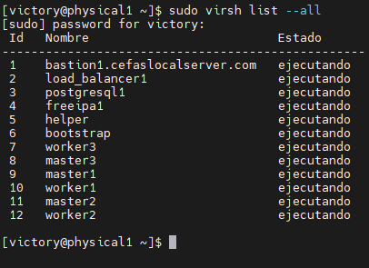

# FlatcarMicroCloud: Entorno Kubernetes Optimizado para Servidores Físicos

## Descripción General del Proyecto

**FlatcarMicroCloud** es una solución Kubernetes diseñada para maximizar los recursos de un servidor físico. El entorno se ejecuta sobre un servidor **ProLiant DL380 G7**, utilizando **Rocky Linux 9.5** como sistema operativo base para virtualización, junto con **AlmaLinux 9.4** en algunos nodos auxiliares. Las máquinas virtuales que componen el clúster Kubernetes utilizan **Flatcar Container Linux** como sistema operativo liviano y seguro.

Esta arquitectura permite desplegar aplicaciones en contenedores mediante herramientas modernas como:

- **K3s**, una distribución ligera de Kubernetes.

- **Longhorn y NFS** para almacenamiento persistente.

- **Prometheus y Grafana** para monitoreo y visualización avanzada.

- **Apache Kafka y MQTT Mosquitto** para comunicación asincrónica entre microservicios.

## Hardware del Servidor

- **Modelo**: ProLiant DL380 G7
- **CPU**: Intel Xeon X5650 (24 cores) @ 2.666GHz
- **GPU**: AMD ATI ES1000
- **Memoria Total**: 35 GB RAM
- **Almacenamiento**:
  - Disco Principal: 1.5TB
  - Disco Secundario: 3.0TB

## Sistemas Operativos y Virtualización

- **Sistemas Operativos**: Rocky Linux 9.5 y Flatcar Container Linux y Alma Linux 9.4
- **Virtualización**: KVM con Libvirt y Virt-Manager
- **Configuración de Red**: VPN con WireGuard, DHCP, firewall, y configuraciones de redes virtuales (NAT y Bridge) con KVM.
- **Switch y Router**: Facilitan la comunicación y conectividad del clúster.

## Resumen de Recursos para Máquinas Virtuales

| Nombre de VM  | CPU | Memoria (MB) | IP            | Nombre de Dominio                  | Tamaño de Disco (GB) | Hostname      |
| ------------- | --- | ------------ | ------------- | ---------------------------------- | -------------------- | ------------- |
| master1       | 2   | 4096         | 10.17.4.21    | master1.cefaslocalserver.com       | 50                   | master1       |
| master2       | 2   | 4096         | 10.17.4.22    | master2.cefaslocalserver.com       | 50                   | master2       |
| master3       | 2   | 4096         | 10.17.4.23    | master3.cefaslocalserver.com       | 50                   | master3       |
| worker1       | 2   | 4096         | 10.17.4.24    | worker1.cefaslocalserver.com       | 50                   | worker1       |
| worker2       | 2   | 4096         | 10.17.4.25    | worker2.cefaslocalserver.com       | 50                   | worker2       |
| worker3       | 2   | 4096         | 10.17.4.26    | worker3.cefaslocalserver.com       | 50                   | worker3       |
| storage1      | 2   | 2048         | 10.17.3.27    | storage1.cefaslocalserver.com      | 80                   | storage1      |
| freeipa1      | 2   | 2048         | 10.17.3.11    | freeipa1.cefaslocalserver.com      | 32                   | freeipa1      |
| loadbalancer1 | 2   | 2048         | 10.17.3.12    | loadbalancer1.cefaslocalserver.com | 32                   | loadbalancer1 |
| loadbalancer2 | 2   | 2048         | 10.17.3.13    | loadbalancer2.cefaslocalserver.com | 32                   | loadbalancer2 |
| postgresql1   | 2   | 2048         | 10.17.3.14    | postgresql1.cefaslocalserver.com   | 32                   | postgresql1   |
| k8s-api-lb    | 2   | 2048         | 10.17.5.10    | k8s-api-lb.cefaslocalserver.com    | 80                   | k8s-api-lb    |

## Máquinas Virtuales y Roles

| Nodo               | Sistema Operativo       | Función                                    | Cantidad |
| ------------------ | ----------------------- | ------------------------------------------ | -------- |
| k8s-api-lb         | Alma Linux              | gestion y seguridad                        | 1        |
| Load Balancer Node | Alma Linux              | Balanceo Traefik controlador de ingress    | 2        |
| FreeIPA Node       | Alma Linux              | DNS y autenticación                        | 1        |
| PostgreSQL Node    | Alma Linux              | Base de datos central para microservicios  | 1        |
| Master Node        | Flatcar Container Linux | Administración de API de Kubernetes        | 3        |
| Worker Nodes       | Flatcar Container Linux | Ejecución de microservicios y aplicaciones | 3        |
| storage1           | Alma Linux              | almacenacenamiento                         | 1        |

## Explicación de Roles de las VMs

- **Maestros (master1, master2, master3)**:

  - Nodos que conforman el plano de control de Kubernetes, manejando la API y distribuyendo la carga en los nodos worker.

- **Workers (worker1, worker2, worker3)**:
- Nodos que ejecutan aplicaciones y microservicios, proporcionando la capacidad de escalar horizontalmente.
  
- **FreeIPA (freeipa1)**:

  - Nodo que actúa como servidor DNS y de autenticación, proporcionando gestión de nombres y autenticación centralizada.

- **Load Balancer (load_balancer1,load_balancer2)**:
  
- Nodos que distribuyen el tráfico de red entre los nodos maestros y workers, asegurando un balanceo de carga eficiente.

- **PostgreSQL (postgresql1)**:

  - Nodo dedicado para la base de datos, proporcionando almacenamiento persistente para las aplicaciones de microservicios.

## Fases de Implementación

### Fase 1: Instalación y Configuración de K3s en el Clúster de Kubernetes

1. **Nodo Master1*: Instalación de K3s y configuración inicial del clúster.
2. **Nodos Master y Worker**: Configuración de nodos maestros y workers, desplegando Traefik como balanceador.

### Fase 2: Configuración de PostgreSQL

| Aspecto                 | Configuración                                                            |
| ----------------------- | ------------------------------------------------------------------------ |
| Servidor                | `postgresql1.cefaslocalserver.com`                                       |
| Permisos                | Ajusta permisos para permitir el acceso de microservicios en el clúster. |
| Respaldo y Recuperación | Define políticas para almacenamiento y recuperación de datos.            |

### Fase 3: Desarrollo e Implementación de Microservicios

- **Apache Kafka**: Canal de comunicación asíncrona entre microservicios.
- **MQTT Mosquitto**: Protocolo ligero para notificaciones en tiempo real.
- **Redis**: Base de datos en memoria para almacenamiento en caché y escalabilidad.

### Fase 4: Desarrollo del Frontend con Vue.js

- **Vue.js** para la interfaz de usuario, conectada a APIs de FastAPI. Desplegado en el clúster con acceso a través del balanceador Traefik.

## Automatización y Orquestación

- **Terraform**: Automatización de infraestructura.
- **Ansible**: Configuración y manejo de operaciones.

## Pasos para la Implementación

### Paso 1: Preparativos Iniciales

Clonar el repositorio en el servidor Rocky Linux.

#### Estructura del Proyecto

- `br0_network/`
- `nat_network_02/`
- `nat_network_03/`

#### Requisitos

- [Terraform](https://www.terraform.io/downloads.html) v0.13 o superior
- Acceso a un servidor KVM con libvirt

## Red y Conectividad

```bash
# Clonar repositorio
git clone https://github.com/vhgalvez/FlatcarMicroCloud.git
cd FlatcarMicroCloud
```

### Paso 2: Configuración de Redes Virtuales con Terraform

- **Red br0_network**:

  ```bash
  # Navegar a br0_network
  cd br0_network
  # Inicializar y aplicar Terraform
  sudo terraform init --upgrade
  sudo terraform apply
  ```

- **Red nat_network_02**:

  ```bash
  # Navegar a nat_network_02
  cd ../nat_network_02
  # Inicializar y aplicar Terraform
  sudo terraform init --upgrade
  sudo terraform apply
  ```

- **Red nat_network_03**:

  ```bash
  # Navegar a nat_network_03
  cd ../nat_network_03
  # Inicializar y aplicar Terraform
  sudo terraform init --upgrade
  sudo terraform apply
  ```

## Notas Adicionales

- Asegúrese de tener las variables y configuraciones adecuadas en los archivos `terraform.tfvars` de cada subproyecto.
- Cada subproyecto tiene su propio `main.tf` y configuración de variables, por lo que no debería haber conflictos de nombres si sigue las instrucciones anteriores.
- Puede ajustar las configuraciones y variables según sea necesario para adaptarse a su entorno y necesidades específicas.

### Paso 3: Instalación de VMs y Sistemas Operativos

Provisionar y configurar VMs según especificaciones en la tabla de recursos, asegurando la asignación de CPU, RAM, y almacenamiento.

### Paso 4: Configuración de Roles en las VMs

- **Master y Worker Nodes**:
  - Configurar K3s en los nodos Master.
  - Desplegar Traefik para el balanceo de carga.
- **FreeIPA Node**: Configurar para DNS y autenticación.
- **Load Balancer1 Load Balancer2**: Configurar con Traefik para distribución de tráfico y controlador de ingress de k3s.
- **PostgreSQL Node**: Configurar permisos y definir políticas de respaldo.

### Paso 5: Configuración de Almacenamiento Persistente

Instalar y configurar Longhorn y NFS en el clúster de Kubernetes para almacenamiento persistente.

### Paso 6: Configuración de Monitoreo y Visualización

- Configurar **Prometheus** y **Grafana** para monitoreo.
- Configurar **ELK Stack** para análisis de logs y visualización de datos.

### Paso 7: Configuración de CI/CD y Automatización

- Configurar **Jenkins**, **GitHub Actions** y **SonarQube** para integración continua.
- Configurar **Harbor**, **Docker Registry** y **Kaniko** para gestión de imágenes de contenedores.
- Configurar **ArgoCD** y **Spinnaker** para despliegue continuo.

### Paso 8: Configuración de Seguridad

Configurar reglas de **firewall**, **Fail2Ban** y políticas de seguridad con **FreeIPA**.

### Paso 9: Sincronización y NTP

Configurar **chronyc** en todos los nodos para sincronización temporal con **FreeIPA**.

### Paso 10: Pruebas Finales y Puesta en Producción

- Verificar configuración de red y DNS.
- Probar despliegue de aplicaciones y monitorización de métricas.
- Asegurar que el balanceador de carga y servicios en Kubernetes estén operativos.

Este flujo garantiza que todas las dependencias y configuraciones sean instaladas en el orden correcto y optimizadas para un entorno de producción.

## Microservicios en Pods

#### Análisis y Visualización de Datos

- **ELK Stack Elasticsearch**: Visualización de métricas del clúster.
- **ELK Stack Kibana**: Visualización de datos.
- **ELK Stack Logstash**: Procesamiento de logs.
- **Prometheus**: Herramientas para el monitoreo, alertas **alertmanager** y visualización de métricas.
- **Grafana**: Visualización de métricas del clúster.
- **cAdvisor**: Monitorear el rendimiento y uso de recursos por parte de los contenedores.
- **Nagios**: Rendimiento del sistema.

#### Microservicios de Servicios de Aplicaciones

- **Nginx**: Servidor web aplicaciones web.
- **Apache Kafka**: Plataforma de mensajería utilizada para la comunicación entre microservicios.
- **Redis**: Almacenamiento en caché y base de datos en memoria para mejorar el rendimiento de las aplicaciones.

## Seguridad y Protección

- **Firewall**: Configuración de reglas de firewall para proteger el clúster.
- **Fail2Ban**: Protección contra accesos no autorizados y ataques.
- **DNS y FreeIPA**: Gestión centralizada de autenticación y políticas de seguridad y servidor de DNS.

## Almacenamiento Persistente

- **Longhorn**: Orquestar Longhorn en Kubernetes para almacenamiento persistente.
- **NFS**: Configurar NFS para almacenamiento compartido entre nodos para base de datos postgresql.

## Kubernetes Operaciones

- **Kubernetes Operators**: Automatización de operaciones en Kubernetes.
- **Kubernetes Helm Charts**: Plantillas predefinidas para despliegues en Kubernetes.
- **Kubernetes Custom Resources**: Recursos personalizados para operaciones específicas en Kubernetes.
- **Kubernetes Ingress**: Gestión de tráfico de red en Kubernetes.
- **Kubernetes Services**: Exposición de servicios en Kubernetes.
- **Kubernetes Volumes**: Almacenamiento persistente en Kubernetes.
- **Kubernetes Namespaces**: Aislamiento de recursos en Kubernetes.
- **Kubernetes RBAC**: Control de acceso basado en roles en Kubernetes.
- **Kubernetes Secrets**: Gestión de secretos en Kubernetes.
- **Kubernetes ConfigMaps**: Gestión de configuraciones en Kubernetes.
- **Kubernetes Network Policies**: Políticas de red en Kubernetes.
- **Kubernetes Pod Security Policies**: Políticas de seguridad en Kubernetes.
- **Kubernetes Pod Disruption Budgets**: Control de la disponibilidad de pods en Kubernetes.
- **Kubernetes Horizontal Pod Autoscaler**: Escalado automático de pods en Kubernetes.
- **Kubernetes Vertical Pod Autoscaler**: Escalado automático de recursos en pods en Kubernetes.
- **Kubernetes Cluster Autoscaler**: Escalado automático de nodos en Kubernetes.
- **Kubernetes Pod Affinity**: Afinidad de pods en Kubernetes.
- **Kubernetes Pod Anti-Affinity**: Anti-afinidad de pods en Kubernetes.
- **Kubernetes Taints and Tolerations**: Tolerancias y restricciones en Kubernetes.
- **Kubernetes DaemonSets**: Despliegue de pods en todos los nodos en Kubernetes.
- **Kubernetes StatefulSets**: Despliegue de aplicaciones con estado en Kubernetes.
- **Kubernetes Jobs**: Ejecución de tareas en Kubernetes.

## Seguridad y Monitoreo

- **FreeIPA**: DNS y gestión de autenticación.
- **Prometheus y Grafana**: Monitoreo avanzado y visualización de métricas.
- **Longhorn y NFS**: Almacenamiento persistente en Kubernetes.
- **Firewall y Fail2Ban**: Seguridad del entorno.

## Redes Virtuales y Arquitectura de Red

### Redes Virtuales Configuradas

| Red NAT         | Nodos         | Dirección IP | Rol del Nodo                             |
| --------------- | ------------- | ------------ | ---------------------------------------- |
| kube_network_02 | freeipa1      | 10.17.3.11   | Servidor de DNS y gestión de identidades |
| kube_network_02 | loadbalancer1 | 10.17.3.12   | Balanceo de carga para el clúster        |
| kube_network_02 | loadbalancer2 | 10.17.3.13   | Balanceo de carga para el clúster        |
| kube_network_02 | postgresql1   | 10.17.3.14   | Gestión de bases de datos                |
| kube_network_03 | master1       | 10.17.4.21   | Gestión del clúster                      |
| kube_network_03 | master1       | 10.17.4.22   | Gestión del clúster                      |
| kube_network_03 | master1       | 10.17.4.23   | Gestión del clúster                      |
| kube_network_03 | worker1       | 10.17.4.24   | Ejecución de aplicaciones                |
| kube_network_03 | worker2       | 10.17.4.25   | Ejecución de aplicaciones                |
| kube_network_03 | worker3       | 10.17.4.26   | Ejecución de aplicaciones                |
| kube_network_03 | storage1      | 10.17.4.27   | alamacenamiento                          |


### Red br0 

| Red NAT | Nodo       | Dirección IP | Rol del Nodo                             |
| ------- | ---------- | ------------ |------------------------------------------|
| br0     | k8s-api-lb | 10.17.5.10   | HAProxy + Keepalived  VIP                |

## Detalles de Configuración

- **Imágenes Base**:

  - Fedora CoreOS: `/mnt/lv_data/organized_storage/images/fedora-coreos-40.20240906.3.0-qemu.x86_64.qcow2`
  - Rocky Linux: `/mnt/lv_data/organized_storage/images/Rocky-9-GenericCloud-Base.latest.x86_64.qcow2`
  - Alma Linux: `/mnt/lv_data/organized_storage/images/AlmaLinux-9.4-x86_64.qcow2`

- **Red Gateway**:
  
  - br0: 10.17.5.1  
  - kube_network_03: 10.17.4.1
  - kube_network_02: 10.17.3.1

- **DNS**:

  - Primario: 10.17.3.11 (FreeIPA)
  - Secundario: 8.8.8.8

- **Zona Horaria**:

  - Europe/London

- **Clave SSH**:

  - Clave pública SSH incluida para acceso seguro a las VMs.

---

## Configuración de Redes Virtuales

### Red br0 - 

```hcl
resource "libvirt_network" "br0" {
  name      = var.rocky9_network_name
   mode      = "nat"
  autostart = true
  addresses = ["10.17.5.0/24"]
}
```

### Red kube_network_02 - NAT Network

```hcl
resource "libvirt_network" "kube_network_02" {
  name      = "kube_network_02"
  mode      = "nat"
  autostart = true
  addresses = ["10.17.3.0/24"]
}
```

### Red kube_network_03 - NAT Network

```hcl
resource "libvirt_network" "kube_network_03" {
  name      = "kube_network_03"
  mode      = "nat"
  autostart = true
  addresses = ["10.17.4.0/24"]
}
```

## Configuración de Redes Virtuales

- **Switch**: TP-Link LS1008G - 8 puertos Gigabit no administrados
- **Router WiFi**: Conexión fibra óptica, 600 Mbps de subida/bajada, IP pública
- **Red**: Configurada red NAT y red Bridge de kvm
- **VPN**: WireGuard para acceso seguro SSH administrado por Bastion Node

## FreeIPA (10.17.3.11)

- **Servidor DNS y NTP (chronyc)**:
  FreeIPA actúa como el servidor DNS, gestionando la resolución de nombres y autenticación dentro del clúster. Además, **chronyc** está configurado para sincronizar el tiempo en todo el clúster, utilizando FreeIPA como uno de los servidores NTP principales.

## Chronyc / NTP

- **Sincronización de tiempo**:
  FreeIPA también proporciona servicios NTP. Todos los nodos del clúster, incluyendo los nodos maestros, workers y el Bootstrap Node, sincronizan su tiempo utilizando **chronyc** y el servidor NTP de FreeIPA (`10.17.3.11`). Esto garantiza que todos los nodos mantengan una sincronización temporal precisa, lo cual es crucial para la operación correcta de Kubernetes y otros servicios distribuidos.

---

## Diagramas de Red y Arquitectura

```bash
                                [Usuarios Públicos]  
                                   |
                   (Acceso HTTPS - Seguridad - Cache)
                                   |
                                   v
+---------------------------+                                  +---------------------------+
| Cloudflare CDN            |                                  | VPS (IP Pública)          |
| WAF + Proxy + DDoS Protect|                                  | Exposición de IP pública  |
| (Ejemplo: example.com)    |                                  | Tunel VPN Seguro          |
+---------------------------+                                  | WireGuard VPN Gateway     |
                                   |                           | IP: 10.17.0.1             |
                                   |                           +---------------------------+
                                   v
                     +--------------------------------------+
                     |  WireGuard VPN (Servidor Físico)     |
                     |  Seguridad y acceso interno          |
                     |  Red LAN Física                      |
                     |  192.168.0.0/24                      |
                     +--------------------------------------+
                                   |
                                   v
                     +--------------------------------------+
                     |  pfSense Firewall & NAT              |
                     |  Seguridad de red                    |
                     |  VPN, Reglas, IDS/IPS                |
                     |  IP: 192.168.0.200                   |
                     +--------------------------------------+
                                   |
                                   v
          +--------------------+--------------------+
          |                                         |
          v                                         v
+---------------------------+         +---------------------------+
|  Load Balancer 1 (Traefik)|         |  Load Balancer 2 (Traefik)|
|      IP: 10.17.3.12       |         |      IP: 10.17.3.13       |
|  (Ingress Controller)     |         |  (Ingress Controller)     |
+---------------------------+         +---------------------------+
                                   |
                                   |
                                   v
          +--------------------------------------------------+
          |   HAProxy + Keepalived (Alta Disponibilidad)     |
          |           k8s-api-lb - VIP: 10.17.5.10           |
          |  - Balanceo de la API de Kubernetes              |
          |  - Failover automático entre Masters             |
          +--------------------------------------------------+
                                   |
                                   v
                   +---------------------------+---------------------------+---------------------------+
                   |                           |                           |
                   v                           v                           v
          +------------------+       +------------------+       +------------------+
          |  Master Node 1   |       |  Master Node 2   |       |  Master Node 3   |
          |       (etcd)     |       |       (etcd)     |       |       (etcd)     |
          |    10.17.4.21    |       |    10.17.4.22    |       |    10.17.4.23    |
          +------------------+       +------------------+       +------------------+
                                   |
                                   v
                   +---------------------------+---------------------------+---------------------------+---------------------------+
                   |                           |                           |                           |
                   v                           v                           v                           v
          +------------------+       +------------------+       +------------------+       +------------------+
          |  Worker Node 1   |       |  Worker Node 2   |       |  Worker Node 3   |       | Storage Node     |
          |                  |       |                  |       |                  |       | Almacenamiento   |
          |    10.17.4.24    |       |    10.17.4.25    |       |    10.17.4.26    |       |    10.17.4.27    |
          +------------------+       +------------------+       +------------------+       +------------------+

                                  |
                                  v
                   +---------------------------+---------------------------+
                   |                           |                           |
                   v                           v                           v
          +---------------------------+   +---------------------------+   +---------------------------+
          |     FreeIPA Node          |   |    PostgreSQL Node        |   |     Storage Node         |
          | DNS/Auth (FreeIPA)        |   | Base de Datos             |   | Almacenamiento Persist.  |
          | IP: 10.17.3.11            |   | IP: 10.17.3.14            |   | IP: 10.17.4.27           |
          +---------------------------+   +---------------------------+   +---------------------------+


                        
```



## Optimización para Producción

| Aspecto                     | Detalle                                                                                            |
| --------------------------- | -------------------------------------------------------------------------------------------------- |
| Restricción de Recursos     | Configura límites en Kubernetes para cada servicio (Prometheus, PostgreSQL, Kafka, Redis).         |
| Control de Logs y Monitoreo | Define políticas de retención de logs en Prometheus y Kafka para reducir el consumo de disco.      |
| Supervisión Activa          | Usa Grafana para monitoreo en tiempo real, ajustando recursos según los picos de carga detectados. |

Estas optimizaciones aseguran un entorno escalable y eficiente para producción.

## Interfaz de Red

| Interfaz     |
| ------------ |
| **enp3s0f0** |
| **enp3s0f1** |
| **enp4s0f0** |
| **enp4s0f1** |
| **lo**       |

Estas interfaces están conectadas a un switch y un router de fibra óptica, operando bajo DHCP y facilitando la conectividad y administración del clúster.

## Resumen del Flujo

1. **Ingreso de Conexiones Externas**: Las conexiones HTTPS externas ingresan por la **IP pública (192.168.0.21)**.
2. **Acceso Seguro**: El tráfico pasa por el **Bastion Node (192.168.0.20)** para acceder de manera segura a la red interna.
3. **Distribución de Tráfico**: El **Load Balancer1 Load Balancer2 (Traefik)** distribuye el tráfico hacia los nodos maestros y workers.
4. **Resolución de Nombres y Sincronización de Tiempo**:
   - **FreeIPA** actúa como servidor DNS y NTP, asegurando la resolución de nombres y la sincronización temporal en todo el clúster.
5. **Ejecución de Aplicaciones**: Los **nodos workers** **nodos master** ejecutan las aplicaciones, manteniendo la sincronización temporal con **FreeIPA** a través de **chronyc**.

## Recursos Adicionales requeridos con el Proyecto

### Automatización ansible para la configuración de FreeIPA DNS

https://github.com/vhgalvez/ansible-freeipa-dns-setup-rockylinux.git

### Automatización ansible para la configuración de NTP

https://github.com/vhgalvez/ansible-ntp-freeipa-kubernetes


### Configuración de K3s en el Clúster de Kubernetes

curl -sfL https://get.k3s.io | K3S_URL=https://K105285ff598aec61abdf70c75ece64e56782d395222d6d8eabc9c49cadd74dcb8f::server:04fd44c81582d038e72d28d2ef7114b7:6443 K3S_TOKEN=<NODE_TOKEN> sh -


sudo curl -sfL https://get.k3s.io | K3S_URL=https://10.17.4.21:6443 K3S_TOKEN=K105285ff598aec61abdf70c75ece64e56782d395222d6d8eabc9c49cadd74dcb8f::server:04fd44c81582d038e72d28d2ef7114b7 sh -

curl -sfL https://get.k3s.io | sh -s - server --node-ip "10.17.4.21" --tls-san "10.17.4.21"


### Acceso a Grafana

http://master1.cefaslocalserver.com:3000

Usuario: admin
Contraseña: prom-operator

## Recursos Adicionales soporatdos por HP

https://support.hpe.com/connect/s/softwaredetails?collectionId=MTX-5db24d8d46d14448&language=en_US&tab=releaseNotes


## Configuración de Redes Virtuales con pfSense y NIC passthrough en KVM (opcional)

- Verificar si la CPU soporta virtualización
 
- grep -E '(vmx|svm)' /proc/cpuinfo
  
- Verificar si la CPU soporta VT-x o AMD-V
