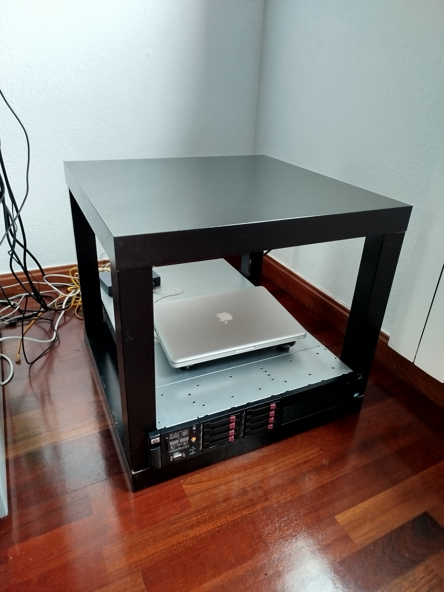
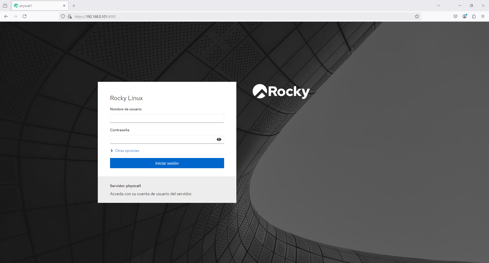
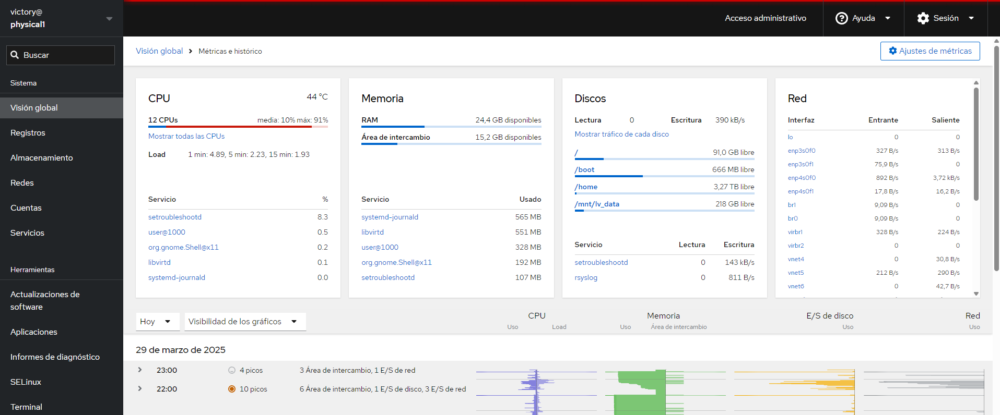
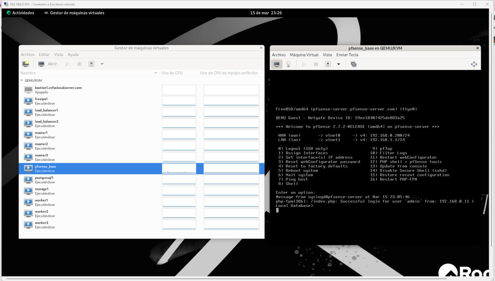

# FlatcarMicroCloud: Entorno Kubernetes Optimizado para Servidores Físicos

## Descripción General

**FlatcarMicroCloud** es una solución Kubernetes diseñada para maximizar los recursos de un servidor físico ProLiant DL380 G7, usando virtualización con **Rocky Linux 9.5**, **AlmaLinux 9.4** y **Flatcar Container Linux**.

Incluye:

- **K3s** como clúster Kubernetes ligero.
- **Longhorn** y **NFS** para almacenamiento persistente.
- **Prometheus**, **Grafana**, **ELK Stack**, **cAdvisor** y **Nagios** para monitoreo.
- **Apache Kafka**, **Redis**, y **MQTT Mosquitto** para comunicación entre microservicios.
- **CoreDNS** para DNS .
- ntp para sincronización de tiempo.

## Hardware del Servidor


- Modelo: ProLiant DL380 G7
- CPU: Intel Xeon X5650 (24 vCores)
- Memoria: 35 GB RAM
- Almacenamiento:
  - Disco Principal: 1.5 TB
  - Disco Secundario: 3.0 TB
- GPU: AMD ATI ES1000

## Sistemas Operativos y Virtualización

- **Rocky Linux 9.5** (Host principal)
- **Flatcar Container Linux** (Nodos Kubernetes)
- **AlmaLinux 9.4** (Servicios auxiliares)
- **Virtualización**: KVM + libvirt + virt-manager
- **VPN**: WireGuard

## Infraestructura de Red

- NAT y Bridge networks con KVM
- pfSense para firewall y NAT
- WireGuard para acceso remoto seguro
- Switch Gigabit TP-Link LS1008G

## Tabla de Máquinas Virtuales

| Hostname      | IP         | Función                    | CPU | RAM (MB) | Disco (GB) |
| ------------- | ---------- | -------------------------- | --- | -------- | ---------- |
| master1       | 10.17.4.21 | Control Plane Kubernetes   | 2   | 4096     | 50         |
| master2       | 10.17.4.22 | Control Plane Kubernetes   | 2   | 4096     | 50         |
| master3       | 10.17.4.23 | Control Plane Kubernetes   | 2   | 4096     | 50         |
| worker1       | 10.17.4.24 | Nodo Worker Kubernetes     | 2   | 4096     | 50         |
| worker2       | 10.17.4.25 | Nodo Worker Kubernetes     | 2   | 4096     | 50         |
| worker3       | 10.17.4.26 | Nodo Worker Kubernetes     | 2   | 4096     | 50         |
| storage1      | 10.17.4.27 | NFS + Longhorn Storage     | 2   | 2048     | 80         |
| infra-cluster | 10.17.3.11 | DNS coredns / ntp  Chrony  | 2   | 2048     | 32         |
| loadbalancer1 | 10.17.3.12 | Ingress Controller Traefik | 2   | 2048     | 32         |
| loadbalancer2 | 10.17.3.13 | Ingress Controller Traefik | 2   | 2048     | 32         |
| postgresql1   | 10.17.3.14 | Base de datos PostgreSQL   | 2   | 2048     | 32         |
| k8s-api-lb    | 10.17.5.10 | VIP HAProxy + Keepalived   | 2   | 2048     | 80         |

## Fases de Implementación

### Fase 1: Despliegue de Kubernetes (K3s HA)

- Desplegar K3s con alta disponibilidad usando etcd.
- Configurar HAProxy + Keepalived como balanceador API Server (VIP).

### Fase 2: Almacenamiento Persistente

- Configurar **Longhorn** y **NFS** para almacenamiento distribuido.
- Rutas principales:
  - `/srv/nfs/postgresql` para base de datos.
  - `/srv/nfs/shared` para archivos compartidos.
  - `/mnt/longhorn-disk` para aplicaciones.

### Fase 3: Servicios de Red y Seguridad

- Configurar ** infra-cluste** para DNS, NTP y autenticación centralizada.
- Implementar **WireGuard** para acceso seguro remoto.

### Fase 4: Monitoreo

- Desplegar **Prometheus**, **Grafana**, **ELK Stack**, **Node Exporter**, **PushGateway** y **cAdvisor**.

### Fase 5: Microservicios

- Backend: FastAPI, PostgreSQL, Redis, Kafka, MQTT.
- Frontend: Vue.js desplegado con Traefik.

### Fase 6: CI/CD y Automatización

- Integración continua con Jenkins, GitHub Actions y SonarQube.
- Despliegue continuo con ArgoCD y Spinnaker.

### Fase 7: Seguridad Adicional

- Firewall, Fail2Ban, nftables, Políticas de RBAC en Kubernetes.

## Automatización

- **Terraform**: Redes virtuales, almacenamiento, VMs.
- **Ansible**: Instalación de Kubernetes, coreDNS, HAProxy, Traefik, Longhorn, Monitoreo.

## Recursos de Automatización

| Proyecto                     | Repositorio                                                                                                                              |
| ---------------------------- | ---------------------------------------------------------------------------------------------------------------------------------------- |
| CoreDNS                      | [https://github.com/vhgalvez/ansible-CoreDNS-setup-Linux](https://github.com/vhgalvez/ansible-CoreDNS-setup-Linux)                       |
| NTP / Chrony                 | [https://github.com/vhgalvez/ansible-ntp-chrony-kubernetes](https://github.com/vhgalvez/ansible-ntp-chrony-kubernetes)                   |
| HAProxy + Keepalived         | [https://github.com/vhgalvez/ansible-k8s-ha-loadbalancer](https://github.com/vhgalvez/ansible-k8s-ha-loadbalancer)                         |
| K3s HA (etcd)                | [https://github.com/vhgalvez/ansible-k3s-etcd-cluster](https://github.com/vhgalvez/ansible-k3s-etcd-cluster)                             |
| Storage NFS + Longhorn       | [https://github.com/vhgalvez/flatcar-k3s-storage-suite](https://github.com/vhgalvez/flatcar-k3s-storage-suite)                           |
| Stack de Monitoreo           | [https://github.com/vhgalvez/ansible-monitoring-stack](https://github.com/vhgalvez/ansible-monitoring-stack)                             |
| Generar Clave SSH Compartida | [https://github.com/vhgalvez/generate_shared_ssh_key](https://github.com/vhgalvez/generate_shared_ssh_key)                               |
| Jenkins CI/CD                | [https://github.com/vhgalvez/jenkins-ansible-playbook](https://github.com/vhgalvez/jenkins-ansible-playbook)                             |
| ArgoCD                       | [https://github.com/vhgalvez/ArgoCD-ansible-kubernetes](https://github.com/vhgalvez/ArgoCD-ansible-kubernetes)                           |


## Redes Virtuales

- kube\_network\_01: 10.17.5.0/24 ( VIP y HA)
- kube\_network\_02: 10.17.3.0/24 (NAT - Servicios auxiliares)
- kube\_network\_03: 10.17.4.0/24 (NAT - Kubernetes)

## Seguridad

- Firewall basado en **nftables**.
- Acceso remoto solo mediante VPN WireGuard.
- Trafico HTTP/HTTPS protegido con Cloudflare.

## Diagramas de Arquitectura

```bash

                         ░░░░░░░░  Infraestructura Global  ░░░░░░░░

                          [Usuarios Públicos]
                                  │
                      (Acceso HTTPS - Seguridad - Cache)
                                  │
                                  ▼
                          +-------------------+
                          |  Cloudflare CDN   | ◄── Proxy + WAF + Anti-DDoS
                          |  (example.com)     |
                          +-------------------+
                                  │
                                  ▼
                      +----------------------------+
                      | VPS (IP pública)           |
                      | WireGuard VPN Gateway      |
                      | IP Túnel: 10.17.0.1        |
                      +----------------------------+
                                  │
                                  ▼
                     +-----------------------------+
                     | WireGuard Server (Físico)   |
                     | Red LAN: 192.168.0.0/24     |
                     +-----------------------------+
                                  │
                                  ▼
                     +-----------------------------+
                     |  servidor fisico nftables   |
                     |  IP: 192.168.0.19           |
                     |  NAT, VPN,                  |
                     +-----------------------------+
                                  │
                      (Redirección de tráfico interno)
                                  ▼
     ┌──────────────────────────────────────────────────────────────────────┐
     │                          Kubernetes Ingress                          │
     └──────────────────────────────────────────────────────────────────────┘
         │                                 │
         ▼                                 ▼
+-------------------------+     +-------------------------+
| Load Balancer 1 (HAProxy)|     | Load Balancer 2 (HAProxy)|
| IP: 10.17.3.12           |     | IP: 10.17.3.13           |
+-------------------------+     +-------------------------+
         │                                 │
         └─────────────┬──────────────────┘
                       ▼
          +---------------------------------------------+
          |  HAProxy + Keepalived (VIP: 10.17.5.10)     |
          |  Balanceo de Kubernetes API + Alta Disp.    |
          |  k8s-api-lb  ip mv: 10.17.5.20              |
          +---------------------------------------------+
                       │
                       ▼
       ┌────────────────────────────────────────────────────────┐
       │                   Kubernetes Control Plane             │
       └────────────────────────────────────────────────────────┘
        │               │                 │
        ▼               ▼                 ▼
+----------------+ +----------------+ +----------------+
| Master Node 1  | | Master Node 2  | | Master Node 3  |
| 10.17.4.21     | | 10.17.4.22     | | 10.17.4.23     |
| (etcd, API)    | | (etcd)         | | (etcd)         |
+----------------+ +----------------+ +----------------+

       ┌──────────────────────────────────────────────────────────────┐
       │                Kubernetes Worker Nodes                       │
       └──────────────────────────────────────────────────────────────┘
        │               │                 │                 │
        ▼               ▼                 ▼                 ▼
+----------------+ +----------------+ +----------------+ +----------------+
| Worker Node 1  | | Worker Node 2  | | Worker Node 3  | | Storage Node   |
| 10.17.4.24     | | 10.17.4.25     | | 10.17.4.26     | | 10.17.4.27     |
|  Longhorn      | | Longhorn       | |    Longhorn    | |  🐂 Longhorn    |
|               | |                | |                 | |  📁 NFS Server  |
+----------------+ +----------------+ +----------------+ +----------------+

                          ⬇ Volúmenes en storage1 ⬇

+---------------------------------------------+
| /srv/nfs/postgresql → PostgreSQL DB         |
| /srv/nfs/shared      → Datos compartidos    |
| /mnt/longhorn-disk   → Volúmenes Longhorn   |
+---------------------------------------------+

                        ⬇ Clientes de almacenamiento ⬇

🔗 NFS Mounts:
- PostgreSQL Node → /srv/nfs/postgresql
- Pods con PVC RWX → /srv/nfs/shared
- /mnt/longhorn-disk

🔗 Longhorn PVCs:
- Prometheus, Grafana, ELK
- Todos los microservicios con almacenamiento distribuido (RWO)

───────────────
🧠 Roles Extra:
───────────────
+-------------------------+     +-------------------------+
| coredns (10.17.3.11)    |     | PostgreSQL (10.17.3.14)  |
| DNS + npt               |     | Base de datos central    |
+-------------------------+     +-------------------------+
```

* NFS sólo gestiona PostgreSQL y datos compartidos (/srv/nfs/postgresql, /srv/nfs/shared)

* Longhorn gestiona todo lo demás (monitoring + apps) desde /mnt/longhorn-disk

* storage1 está configurado con volúmenes LVM para aislar el espacio y prevenir desbordes

* La infraestructura está protegida por VPN (WireGuard), nftables y expuesta con seguridad vía Cloudflare


## Autenticación segura:

✅ basicAuth (para dashboards internos como Jenkins, Grafana, ArgoCD, etec).

## IMAGENES DEL PROYECTO 












## Resumen Final

- **Alta Disponibilidad:** K3s HA, balanceadores redundantes, almacenamiento distribuido.
- **Seguridad:** VPN, Firewall, DNS y autenticación gestionados.
- **Escalabilidad:** Arquitectura modular y preparada para crecer.
- **Automatización Total:** Todo desplegable por Ansible y Terraform.
- **Monitoreo Avanzado:** Prometheus, Grafana, ELK, cAdvisor y Nagios.

---

# 🌟 Proyecto FlatcarMicroCloud: Optimización Real para Kubernetes en Hardware Físico 🌟
