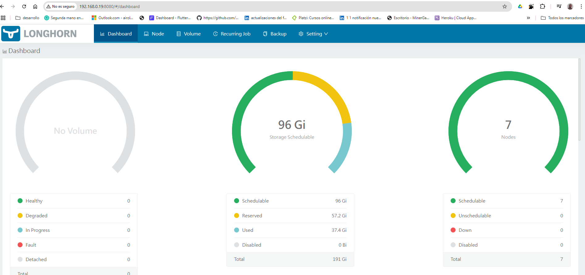

# FlatcarMicroCloud: Entorno Kubernetes Optimizado para Servidores Físicos

## Descripción General

**FlatcarMicroCloud** es una solución Kubernetes diseñada para maximizar los recursos de un servidor físico ProLiant DL380 G7, usando virtualización con **Rocky Linux 9.5**, **AlmaLinux 9.4** y **Flatcar Container Linux**.

Incluye:

- **K3s** como clúster Kubernetes ligero.
- **Longhorn** y **NFS** para almacenamiento persistente.
- **Prometheus**, **Grafana**, **ELK Stack**, **cAdvisor** y **Nagios** para monitoreo.
- **Apache Kafka**, **Redis**, y **MQTT Mosquitto** para comunicación entre microservicios.
- **FreeIPA** para DNS y autenticación.

## Hardware del Servidor

- Modelo: ProLiant DL380 G7
- CPU: Intel Xeon X5650 (24 vCores)
- Memoria: 35 GB RAM
- Almacenamiento:
  - Disco Principal: 1.5 TB
  - Disco Secundario: 3.0 TB
- GPU: AMD ATI ES1000

## Sistemas Operativos y Virtualización

- **Rocky Linux 9.5** (Host principal)
- **Flatcar Container Linux** (Nodos Kubernetes)
- **AlmaLinux 9.4** (Servicios auxiliares)
- **Virtualización**: KVM + libvirt + virt-manager
- **VPN**: WireGuard

## Infraestructura de Red

- NAT y Bridge networks con KVM
- pfSense para firewall y NAT
- WireGuard para acceso remoto seguro
- Switch Gigabit TP-Link LS1008G

## Tabla de Máquinas Virtuales

| Hostname      | IP         | Función                    | CPU | RAM (MB) | Disco (GB) |
| ------------- | ---------- | -------------------------- | --- | -------- | ---------- |
| master1       | 10.17.4.21 | Control Plane Kubernetes   | 2   | 4096     | 50         |
| master2       | 10.17.4.22 | Control Plane Kubernetes   | 2   | 4096     | 50         |
| master3       | 10.17.4.23 | Control Plane Kubernetes   | 2   | 4096     | 50         |
| worker1       | 10.17.4.24 | Nodo Worker Kubernetes     | 2   | 4096     | 50         |
| worker2       | 10.17.4.25 | Nodo Worker Kubernetes     | 2   | 4096     | 50         |
| worker3       | 10.17.4.26 | Nodo Worker Kubernetes     | 2   | 4096     | 50         |
| storage1      | 10.17.4.27 | NFS + Longhorn Storage     | 2   | 2048     | 80         |
| infra-cluster | 10.17.3.11 | DNS / ntp                  | 2   | 2048     | 32         |
| loadbalancer1 | 10.17.3.12 | Ingress Controller Traefik | 2   | 2048     | 32         |
| loadbalancer2 | 10.17.3.13 | Ingress Controller Traefik | 2   | 2048     | 32         |
| postgresql1   | 10.17.3.14 | Base de datos PostgreSQL   | 2   | 2048     | 32         |
| k8s-api-lb    | 10.17.5.10 | VIP HAProxy + Keepalived   | 2   | 2048     | 80         |

## Fases de Implementación

### Fase 1: Despliegue de Kubernetes (K3s HA)

- Desplegar K3s con alta disponibilidad usando etcd.
- Configurar HAProxy + Keepalived como balanceador API Server (VIP).

### Fase 2: Almacenamiento Persistente

- Configurar **Longhorn** y **NFS** para almacenamiento distribuido.
- Rutas principales:
  - `/srv/nfs/postgresql` para base de datos.
  - `/srv/nfs/shared` para archivos compartidos.
  - `/mnt/longhorn-disk` para aplicaciones.

### Fase 3: Servicios de Red y Seguridad

- Configurar **FreeIPA** para DNS, NTP y autenticación centralizada.
- Implementar **WireGuard** para acceso seguro remoto.

### Fase 4: Monitoreo

- Desplegar **Prometheus**, **Grafana**, **ELK Stack**, **Node Exporter**, **PushGateway** y **cAdvisor**.

### Fase 5: Microservicios

- Backend: FastAPI, PostgreSQL, Redis, Kafka, MQTT.
- Frontend: Vue.js desplegado con Traefik.

### Fase 6: CI/CD y Automatización

- Integración continua con Jenkins, GitHub Actions y SonarQube.
- Despliegue continuo con ArgoCD y Spinnaker.

### Fase 7: Seguridad Adicional

- Firewall, Fail2Ban, Políticas de RBAC en Kubernetes.

## Automatización

- **Terraform**: Redes virtuales, almacenamiento, VMs.
- **Ansible**: Instalación de Kubernetes, FreeIPA, HAProxy, Traefik, Longhorn, Monitoreo.

## Recursos de Automatización

| Proyecto                     | Repositorio                                                                                                                              |
| ---------------------------- | ---------------------------------------------------------------------------------------------------------------------------------------- |
| CoreDNS                      | [https://github.com/vhgalvez/ansible-CoreDNS-setup-Linux](https://github.com/vhgalvez/ansible-CoreDNS-setup-Linux)                       |
| NTP / Chrony                 | [https://github.com/vhgalvez/ansible-ntp-chrony-kubernetes](https://github.com/vhgalvez/ansible-ntp-chrony-kubernetes)                   |
| HAProxy + Keepalived         | [https://github.com/vhgalvez/ansible-haproxy-keepalived](https://github.com/vhgalvez/ansible-haproxy-keepalived)                         |
| K3s HA (etcd)                | [https://github.com/vhgalvez/ansible-k3s-etcd-cluster](https://github.com/vhgalvez/ansible-k3s-etcd-cluster)                             |
| Traefik Ingress Controller   | [https://github.com/vhgalvez/traefik-k8s-ingress-controller-ansible](https://github.com/vhgalvez/traefik-k8s-ingress-controller-ansible) |
| Storage NFS + Longhorn       | [https://github.com/vhgalvez/flatcar-k3s-storage-suite](https://github.com/vhgalvez/flatcar-k3s-storage-suite)                           |
| Stack de Monitoreo           | [https://github.com/vhgalvez/ansible-monitoring-stack](https://github.com/vhgalvez/ansible-monitoring-stack)                             |
| Generar Clave SSH Compartida | [https://github.com/vhgalvez/generate_shared_ssh_key](https://github.com/vhgalvez/generate_shared_ssh_key)                            |

## Redes Virtuales

- kube\_network\_01: 10.17.5.0/24 ( VIP y HA)
- kube\_network\_02: 10.17.3.0/24 (NAT - Servicios auxiliares)
- kube\_network\_03: 10.17.4.0/24 (NAT - Kubernetes)

## Seguridad

- Firewall basado en **nftables**.
- Acceso remoto solo mediante VPN WireGuard.
- Trafico HTTP/HTTPS protegido con Cloudflare.

## Diagramas de Arquitectura

## Resumen Final

- **Alta Disponibilidad:** K3s HA, balanceadores redundantes, almacenamiento distribuido.
- **Seguridad:** VPN, Firewall, DNS y autenticación gestionados.
- **Escalabilidad:** Arquitectura modular y preparada para crecer.
- **Automatización Total:** Todo desplegable por Ansible y Terraform.
- **Monitoreo Avanzado:** Prometheus, Grafana, ELK, cAdvisor y Nagios.

---

# 🌟 Proyecto FlatcarMicroCloud: Optimización Real para Kubernetes en Hardware Físico 🌟 
