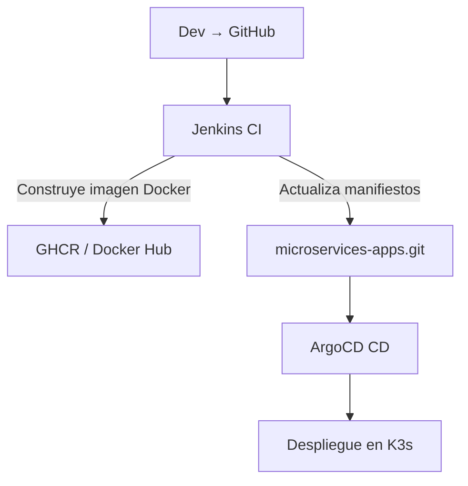

# README Arquitectura 04

## Introducción

Este documento describe el flujo de trabajo para la provisión de infraestructura, instalación de servicios básicos y activación de GitOps en un clúster K3s HA. Se detalla el orden de las etapas, herramientas utilizadas y cómo se integran los diferentes componentes.

---

## Etapas del Flujo DevOps + GitOps

### 1. Provisión de Infraestructura (Infra as Code)

**Herramientas usadas:** Terraform, Ansible, KVM, libvirt, Flatcar, Rocky Linux

**Repositorios clave:**

- `generate_shared_ssh_key`
- `ansible-CoreDNS-setup-Linux`
- `ansible-ntp-chrony-kubernetes`
- `ansible-k8s-ha-loadbalancer`
- `ansible-k3s-etcd-cluster`

**Qué haces aquí:**

1. Creas las VMs (con Terraform y libvirt).

2. Configuras la red, DNS, NTP, y claves SSH compartidas.

3. Instalas el clúster K3s HA.

4. Despliegas balanceadores y almacenamiento (Longhorn + NFS).

🔹 **Nota:** En este punto, NO entra aún GitOps. Todo es "Push manual" vía Ansible.

---

### 2. Instalación de Servicios Básicos de Clúster

**Herramientas usadas:** Ansible + Helm

**Servicios desplegados:**

- Traefik (Ingress)
- Grafana, Prometheus
- PostgreSQL, Redis, etc.
- Sealed Secrets Controller

**Repositorios clave:**

- `traefik-ansible-k3s-cluster`
- `ansible-monitoring-stack`
- `postgres-ansible-nfs`
- `k3s-secrets-cluster`

**Qué haces aquí:**

1. Creas los SealedSecret.

2. Defines Ingress con reglas seguras.

3. Cargas certificados, secretos, etc.

🔹 **Nota:** Esta fase aún es provisión tradicional (Ansible). Pero ya estás preparando el terreno para GitOps.

---

### 3. CI/CD y Activación de GitOps

**Herramientas usadas:** Jenkins, ArgoCD, GitHub, GHCR

**Repositorios clave:**

- `jenkins-ansible-playbook`
- `ArgoCD-ansible-kubernetes`
- `microservices-apps` (privado)
- `sealed-secrets`, etc.

**Qué haces aquí:**

1. Instalas ArgoCD en el clúster.

2. Configuras ArgoCD para ver un repositorio Git con manifiestos (Helm o YAML).

3. ArgoCD sincroniza el estado del clúster con lo que ve en Git.

4. Si hay cambios en Git → se aplica automáticamente en el clúster.

📌 **También en esta fase:**

- Jenkins genera las imágenes de microservicios.

- Publica en GHCR o DockerHub.

- ArgoCD despliega esa versión si detecta actualización en los manifiestos.

---

## Detalles Adicionales

### Orden de Instalación Corregido

| Orden | Proyecto                          | Repositorio                        | ¿Por qué en este paso?                          |
|-------|-----------------------------------|------------------------------------|------------------------------------------------|
| 1️⃣   | 🔐 Claves SSH compartidas         | `generate_shared_ssh_key`         | Automatiza conexión Ansible entre nodos        |
| 2️⃣   | 🕒 NTP / Chrony                   | `ansible-ntp-chrony-kubernetes`   | Evita fallos de etcd y certificados            |
| 3️⃣   | 🌐 CoreDNS                        | `ansible-CoreDNS-setup-Linux`     | DNS interno para resolución entre nodos        |
| 4️⃣   | ⚖️ HAProxy + Keepalived          | `ansible-k8s-ha-loadbalancer`     | Balanceo de tráfico API/Ingress con VIPs       |
| 5️⃣   | ☸️ K3s HA con etcd               | `ansible-k3s-etcd-cluster`        | Despliegue del clúster principal               |
| 6️⃣   | 🧩 VIP Master1                   | `k3s-vip-switch-master1-bootstrap`| Reconfigura master1 con la VIP                 |
| 7️⃣   | 💾 NFS + Longhorn                | `flatcar-k3s-storage-suite`       | Soporte de almacenamiento persistente          |
| 8️⃣   | 🚪 Traefik Ingress               | `traefik-ansible-k3s-cluster`     | Controlador de entrada web                     |
| 9️⃣   | 🔐 Sealed Secrets                | (manual/automatizado)             | Permite cifrar secretos usados por ArgoCD, etc.|
| 1️⃣0️⃣ | 📊 Monitoring Stack             | `ansible-monitoring-stack`        | Usa secretos opcionales (htpasswd, tokens)     |
| 1️⃣1️⃣ | 🚀 ArgoCD GitOps                | `ArgoCD-ansible-kubernetes`       | Puedes sellar `argocd-secret` (admin)          |
| 1️⃣2️⃣ | 🔄 Jenkins CI/CD                | `jenkins-ansible-playbook`        | Usa SealedSecrets para htpasswd o tokens       |

---

### Diagrama de Flujo Simplificado

---

## Conclusión

- GitOps entra después de provisionar el clúster y servicios base.

- GitOps no reemplaza a Ansible o Terraform; los complementa.

- La infraestructura la defines con Ansible/Terraform.

- Los despliegues de apps, secretos y configuraciones los gestiona GitOps con ArgoCD.
