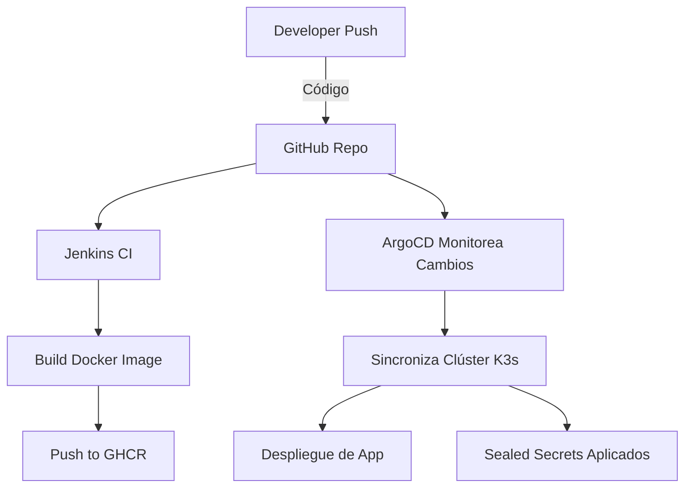

# Guía Completa: GitOps + CI/CD + Sealed Secrets en FlatcarMicroCloud

## ✅ Etapas Técnicas de Implementación (Flujo DevOps + GitOps)

### 🔧 FASE 1 – Infraestructura y Red (IaC)

| Paso | Descripción                                               | Repositorio                                                                                         |
| ---- | --------------------------------------------------------- | --------------------------------------------------------------------------------------------------- |
| 1.1  | Generar clave SSH compartida para automatización          | [🔐 generate\_shared\_ssh\_key](https://github.com/vhgalvez/generate_shared_ssh_key)                |
| 1.2  | Configurar CoreDNS para resolución interna                | [🌐 ansible-CoreDNS-setup-Linux](https://github.com/vhgalvez/ansible-CoreDNS-setup-Linux)           |
| 1.3  | Sincronización NTP en todos los nodos                     | [🕒 ansible-ntp-chrony-kubernetes](https://github.com/vhgalvez/ansible-ntp-chrony-kubernetes)       |
| 1.4  | Balanceador HA + VIP con HAProxy y Keepalived             | [⚖️ ansible-k8s-ha-loadbalancer](https://github.com/vhgalvez/ansible-k8s-ha-loadbalancer)           |
| 1.5  | Despliegue del clúster K3s en modo HA con etcd            | [☸️ ansible-k3s-etcd-cluster](https://github.com/vhgalvez/ansible-k3s-etcd-cluster)                 |
| 1.6  | Configuración del VIP en master1 para romper dependencias | [🧩 k3s-vip-switch-master1-bootstrap](https://github.com/vhgalvez/k3s-vip-switch-master1-bootstrap) |

---

### 📦 FASE 2 – Servicios Base y Almacenamiento

| Paso | Descripción                              | Repositorio                                                                               |
| ---- | ---------------------------------------- | ----------------------------------------------------------------------------------------- |
| 2.1  | Configurar almacenamiento Longhorn y NFS | [💾 flatcar-k3s-storage-suite](https://github.com/vhgalvez/flatcar-k3s-storage-suite)     |
| 2.2  | Instalar y configurar PostgreSQL en NFS  | [postgres-ansible-nfs](https://github.com/vhgalvez/postgres-ansible-nfs)                  |
| 2.3  | Instalar Traefik como Ingress Controller | [🚪 traefik-ansible-k3s-cluster](https://github.com/vhgalvez/traefik-ansible-k3s-cluster) |
| 2.4  | Stack de monitoreo Prometheus + Grafana  | [📊 ansible-monitoring-stack](https://github.com/vhgalvez/ansible-monitoring-stack)       |

---

### 🔐 FASE 3 – Gestión de Secretos con Sealed Secrets

| Paso | Descripción                                   | Repositorio                                                            |
| ---- | --------------------------------------------- | ---------------------------------------------------------------------- |
| 3.1  | Instalar Sealed Secrets Controller vía Helm   | [k3s-secrets-cluster](https://github.com/vhgalvez/k3s-secrets-cluster) |
| 3.2  | Crear y cifrar secretos con kubeseal          | Incluido en `k3s-secrets-cluster`                                      |
| 3.3  | Aplicar SealedSecrets para servicios críticos | Incluido en `k3s-secrets-cluster`                                      |

---

### 🔁 FASE 4 – CI/CD y GitOps con Jenkins + ArgoCD

| Paso | Descripción                                    | Repositorio                                                                           |
| ---- | ---------------------------------------------- | ------------------------------------------------------------------------------------- |
| 4.1  | Instalar ArgoCD en el clúster                  | [🚀 ArgoCD-ansible-kubernetes](https://github.com/vhgalvez/ArgoCD-ansible-kubernetes) |
| 4.2  | Configurar "app of apps" en ArgoCD             | `argocd-apps/` con manifiestos YAML                                                   |
| 4.3  | Instalar Jenkins y configurar pipeline CI      | [🔄 jenkins-ansible-playbook](https://github.com/vhgalvez/jenkins-ansible-playbook)   |
| 4.4  | Jenkins construye imágenes y las sube a GHCR   | `microservices-apps` (público o privado)                                              |
| 4.5  | ArgoCD detecta cambios y sincroniza el clúster | `microservices-apps`, `sealed-secrets-cluster`                                        |

---

## 📈 Diagrama de Flujo CI/CD + GitOps

---

## 📌 Conclusión

* La provisión de infraestructura se realiza con Ansible y Terraform.
* Sealed Secrets permite cifrado de secretos en Git con seguridad total.
* Jenkins automatiza el proceso de build y publicación.
* ArgoCD implementa GitOps: sincroniza el clúster automáticamente con Git.
* La separación de repositorios por propósito (infraestructura, apps, secretos) mejora la seguridad, escalabilidad y mantenibilidad del sistema.

# 🔐 Seguridad en FlatcarMicroCloud con Sealed Secrets y más

## 🎯 Objetivo

Sealed Secrets se utiliza en este proyecto para gestionar secretos de Kubernetes de forma segura y compatible con GitOps, evitando exponer datos sensibles como contraseñas, tokens o claves en repositorios públicos o privados.

---

## 🧩 Rol de Sealed Secrets en la Arquitectura

* **Ubicación**: El Sealed Secrets Controller se despliega dentro del clúster K3s, en el namespace `kube-system`.
* **Responsabilidad**: Es el único componente capaz de descifrar los secretos cifrados (SealedSecrets) y convertirlos automáticamente en Secrets reales dentro del clúster.
* **Relación con GitOps**: Permite almacenar secretos cifrados en GitHub y aplicarlos automáticamente mediante ArgoCD sin comprometer la seguridad.

---

## 🛠️ Flujo de Trabajo Teórico con Sealed Secrets

1. **Instalación del Controller**

   * Se instala una única vez con Helm o vía Ansible (`playbooks/install_sealed_secrets.yml`).
   * Vive en el clúster y escucha los `SealedSecret`.

2. **Instalación de kubeseal**

   * Herramienta CLI que se instala localmente para cifrar los `Secret`.
   * Se puede instalar con Ansible o manualmente.

3. **Obtención del certificado público**

   * Se ejecuta `kubeseal --fetch-cert` para obtener la clave pública del controlador.
   * Este archivo (`sealed-secrets-public-cert.pem`) se usa para cifrar secretos desde fuera del clúster.

4. **Creación de Secret en plantilla**

   * Se define un Secret estándar en YAML, pero NO se aplica directamente al clúster.
   * Ejemplo: usuario y contraseña para Traefik, Grafana, Jenkins, etc.

5. **Cifrado del Secret**

   * Con `kubeseal`, se cifra el Secret con la clave pública.
   * El resultado es un `SealedSecret`, seguro para subir a Git.

6. **Repositorio privado para SealedSecrets**

   * Se almacena el `SealedSecret` en el repositorio `sealed-secrets-cluster/`.
   * ArgoCD lo monitorea y lo aplica automáticamente al clúster.

7. **El controlador crea el Secret real**

   * El `SealedSecret` es detectado por el controller.
   * Se crea el `Secret` original dentro del namespace correspondiente.

8. **Los servicios acceden al Secret**

   * Los deployments o charts de Helm hacen referencia al `Secret` real como siempre (`secretKeyRef`).

---

## 🔒 Buenas prácticas en el proyecto

| Componente                | Público/Privado   | Motivo                                         |
| ------------------------- | ----------------- | ---------------------------------------------- |
| `sealed-secrets-cluster/` | 🔒 Privado        | Contiene todos los SealedSecrets cifrados      |
| `pub-cert.pem`            | ✅ Público         | Solo permite cifrar, no descifrar              |
| `Secret.yaml` sin cifrar  | 🔥 Nunca público  | Solo temporal en local para usar con kubeseal  |
| `SealedSecret.yaml`       | ✅ Seguro para Git | Se puede versionar y aplicar con GitOps/ArgoCD |

## 📌 Resultado

* **Git seguro**: puedes almacenar secretos cifrados sin exponer datos.
* **Automatización total**: todo el ciclo funciona con Git + ArgoCD.
* **Escalabilidad**: puedes crear tantos secretos como quieras con el mismo flujo.
* **Aislamiento**: los secretos están en un repositorio separado, bien estructurado.

## ✅ SealedSecrets recomendados para este proyecto

* `jenkins-admin-secret`

* `grafana-admin-secret`

* `argocd-secret`

* `traefik-dashboard-secret`

* `smtp-password-secret`\\

*

---

## 🛡️ Herramientas de Seguridad en el Proyecto FlatcarMicroCloud

### 1. Gestión de Secretos

| Herramienta    | Función                                                          |
| -------------- | ---------------------------------------------------------------- |
| Sealed Secrets | Cifrado y gestión de secretos Kubernetes vía GitOps              |
| kubeseal CLI   | Cifrado local de secretos usando la clave pública del controller |

### 2. Autenticación y Autorización

| Herramienta            | Función                                                |
| ---------------------- | ------------------------------------------------------ |
| BasicAuth (Traefik)    | Protección de dashboards con usuario y contraseña      |
| SSH + Clave Compartida | Acceso seguro a VMs (usando `generate_shared_ssh_key`) |

### 3. Firewall y Red

| Herramienta | Función                                                        |
| ----------- | -------------------------------------------------------------- |
| nftables    | Reglas de firewall para restringir puertos expuestos           |
| Fail2Ban    | Bloqueo de intentos de fuerza bruta (especialmente en SSH)     |
| WireGuard   | Acceso remoto seguro mediante túneles cifrados                 |
| Keepalived  | Alta disponibilidad con IPs virtuales (failover activo-pasivo) |
| HAProxy     | Balanceo de carga controlado y seguro                          |

### 4. Red Privada y Túneles

| Herramienta           | Función                                                        |
| --------------------- | -------------------------------------------------------------- |
| WireGuard VPN         | Acceso seguro punto a punto para gestión remota                |
| Cloudflare DNS + DDNS | Resolución de dominio dinámica + ocultación de IP pública real |

### 5. Aislamiento de Contenedores y CNI

| Herramienta     | Función                                                                    |
| --------------- | -------------------------------------------------------------------------- |
| K3s con Flannel | Red interna entre pods con aislamiento por nodo                            |
| Traefik Ingress | Exposición solo de servicios permitidos, con TLS y autenticación integrada |

### 6. Certificados TLS

| Herramienta              | Función                                                   |
| ------------------------ | --------------------------------------------------------- |
| TLS autofirmado          | Cifrado interno en entornos de prueba                     |
| Let's Encrypt (opcional) | Certificados válidos públicos automatizados en producción |

### 7. GitOps Seguro

| Herramienta                  | Función                                                            |
| ---------------------------- | ------------------------------------------------------------------ |
| ArgoCD                       | Despliegue automático desde repositorios Git autorizados           |
| Repos privados en GitHub     | Separación de secretos (`sealed-secrets-cluster`)                  |
| GHCR (GitHub Container Reg.) | Evita exposición de imágenes en registries públicos como DockerHub |

### 8. Monitorización de Seguridad

| Herramienta          | Función                                                             |
| -------------------- | ------------------------------------------------------------------- |
| Prometheus + Grafana | Métricas, alertas, visualización del estado de servicios y recursos |
| Alertmanager         | Notificaciones automáticas ante condiciones anómalas o de riesgo    |

---

Aquí tienes una lista completa y analizada de todos los elementos que deben ser securizados en el proyecto FlatcarMicroCloud, con foco en:

Dashboards y accesos HTTP (Traefik, Jenkins, Grafana, ArgoCD…).

Credenciales y secretos.

Configuraciones internas que pueden exponerse.

Elementos que pueden ser gestionados con Sealed Secrets.

✅ Elementos que deben ser securizados por categoría
Categoría	Recurso / Servicio	Método recomendado de seguridad	Securizar con Sealed Secrets
🔑 Autenticación de Dashboard	Jenkins Admin	BasicAuth o jenkins-admin-secret	✅ Sí
Grafana Admin	Secret grafana-admin-secret	✅ Sí
Traefik Dashboard	BasicAuth traefik-dashboard-secret	✅ Sí
ArgoCD Login	argocd-secret (password/token inicial)	✅ Sí
PostgreSQL Password	postgres-secret	✅ Sí
SMTP Password	smtp-password-secret (si usas email)	✅ Sí
Webhook GitHub / CI/CD tokens	webhook-token-secret	✅ Sí

🧩 Servicios que necesitan protección extra (no solo con Sealed Secrets)
Servicio / Componente	Protección recomendada	Sealed Secrets	Adicionalmente
HAProxy Dashboard	🔒 Deshabilitar / BasicAuth (opcional)	⚠️ No aplica	Firewall / nftables
Longhorn UI	🔐 Solo acceso por VPN / admin password	⚠️ Parcial	WireGuard / nftables
CoreDNS	Protegido por defecto	❌ No necesario	Red interna
NTP Chrony	No requiere secretos	❌ No	Solo puertos internos
Prometheus + Grafana	Grafana: usuario/clave	✅ Sí	HTTPS, firewall
Jenkins	Admin + API Token	✅ Sí	BasicAuth + firewall
ArgoCD	Login local, tokens, conexión Git	✅ Sí	TLS + token rotación
Traefik	BasicAuth + TLS para dashboard	✅ Sí	Firewall + Sealed

🔐 Lista sugerida de SealedSecret a implementar
Nombre del SealedSecret	Namespace	Descripción
jenkins-admin-secret	jenkins	Usuario y contraseña del admin Jenkins
grafana-admin-secret	monitoring	Credenciales de acceso a Grafana
traefik-dashboard-secret	kube-system	BasicAuth en Traefik
argocd-secret	argocd	Login inicial o tokens ArgoCD
postgres-secret	default o db	Password acceso PostgreSQL
smtp-password-secret	default	Password para envío de notificaciones
webhook-github-secret	ci	Token de GitHub Webhook (CI/CD triggers)
