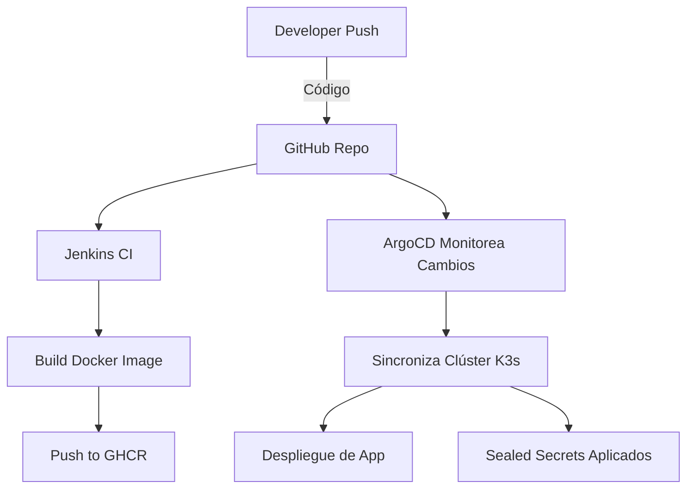

# Guía Completa: GitOps + CI/CD + Sealed Secrets en FlatcarMicroCloud

## ✅ Etapas Técnicas de Implementación (Flujo DevOps + GitOps)

### 🔧 FASE 1 – Infraestructura y Red (IaC)

| Paso | Descripción                                               | Repositorio                                                                                         |
| ---- | --------------------------------------------------------- | --------------------------------------------------------------------------------------------------- |
| 1.1  | Generar clave SSH compartida para automatización          | [🔐 generate\_shared\_ssh\_key](https://github.com/vhgalvez/generate_shared_ssh_key)                |
| 1.2  | Configurar CoreDNS para resolución interna                | [🌐 ansible-CoreDNS-setup-Linux](https://github.com/vhgalvez/ansible-CoreDNS-setup-Linux)           |
| 1.3  | Sincronización NTP en todos los nodos                     | [🕒 ansible-ntp-chrony-kubernetes](https://github.com/vhgalvez/ansible-ntp-chrony-kubernetes)       |
| 1.4  | Balanceador HA + VIP con HAProxy y Keepalived             | [⚖️ ansible-k8s-ha-loadbalancer](https://github.com/vhgalvez/ansible-k8s-ha-loadbalancer)           |
| 1.5  | Despliegue del clúster K3s en modo HA con etcd            | [☸️ ansible-k3s-etcd-cluster](https://github.com/vhgalvez/ansible-k3s-etcd-cluster)                 |
| 1.6  | Configuración del VIP en master1 para romper dependencias | [🧩 k3s-vip-switch-master1-bootstrap](https://github.com/vhgalvez/k3s-vip-switch-master1-bootstrap) |

---

### 📦 FASE 2 – Servicios Base y Almacenamiento

| Paso | Descripción                              | Repositorio                                                                               |
| ---- | ---------------------------------------- | ----------------------------------------------------------------------------------------- |
| 2.1  | Configurar almacenamiento Longhorn y NFS | [💾 flatcar-k3s-storage-suite](https://github.com/vhgalvez/flatcar-k3s-storage-suite)     |
| 2.2  | Instalar y configurar PostgreSQL en NFS  | [postgres-ansible-nfs](https://github.com/vhgalvez/postgres-ansible-nfs)                  |
| 2.3  | Instalar Traefik como Ingress Controller | [🚪 traefik-ansible-k3s-cluster](https://github.com/vhgalvez/traefik-ansible-k3s-cluster) |
| 2.4  | Stack de monitoreo Prometheus + Grafana  | [📊 ansible-monitoring-stack](https://github.com/vhgalvez/ansible-monitoring-stack)       |

---

### 🔐 FASE 3 – Gestión de Secretos con Sealed Secrets

| Paso | Descripción                                   | Repositorio                                                            |
| ---- | --------------------------------------------- | ---------------------------------------------------------------------- |
| 3.1  | Instalar Sealed Secrets Controller vía Helm   | [k3s-secrets-cluster](https://github.com/vhgalvez/k3s-secrets-cluster) |
| 3.2  | Crear y cifrar secretos con kubeseal          | Incluido en `k3s-secrets-cluster`                                      |
| 3.3  | Aplicar SealedSecrets para servicios críticos | Incluido en `k3s-secrets-cluster`                                      |

---

### 🔁 FASE 4 – CI/CD y GitOps con Jenkins + ArgoCD

| Paso | Descripción                                    | Repositorio                                                                           |
| ---- | ---------------------------------------------- | ------------------------------------------------------------------------------------- |
| 4.1  | Instalar ArgoCD en el clúster                  | [🚀 ArgoCD-ansible-kubernetes](https://github.com/vhgalvez/ArgoCD-ansible-kubernetes) |
| 4.2  | Configurar "app of apps" en ArgoCD             | `argocd-apps/` con manifiestos YAML                                                   |
| 4.3  | Instalar Jenkins y configurar pipeline CI      | [🔄 jenkins-ansible-playbook](https://github.com/vhgalvez/jenkins-ansible-playbook)   |
| 4.4  | Jenkins construye imágenes y las sube a GHCR   | `microservices-apps` (público o privado)                                              |
| 4.5  | ArgoCD detecta cambios y sincroniza el clúster | `microservices-apps`, `sealed-secrets-cluster`                                        |

---

## 📈 Diagrama de Flujo CI/CD + GitOps

---

## 📌 Conclusión

* La provisión de infraestructura se realiza con Ansible y Terraform.
* Sealed Secrets permite cifrado de secretos en Git con seguridad total.
* Jenkins automatiza el proceso de build y publicación.
* ArgoCD implementa GitOps: sincroniza el clúster automáticamente con Git.
* La separación de repositorios por propósito (infraestructura, apps, secretos) mejora la seguridad, escalabilidad y mantenibilidad del sistema.
